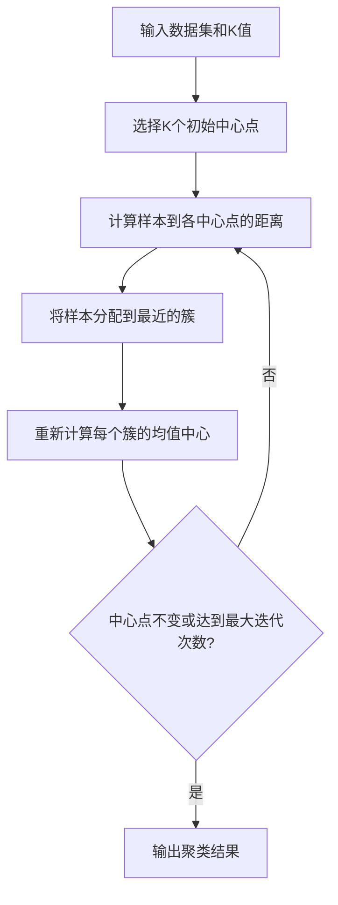

# 机器学习章节重点笔记

> 本笔记根据机器学习章节课件整理，重点放在“聚类”和“卷积神经网络”，并补充题目涉及的机器学习概述、线性回归、神经网络与 BP 神经网络知识。结尾包含题目答案与解析。

## 1. 机器学习概述

### 1.1 机器学习的定义

机器学习（Machine Learning）是一门研究计算机如何模拟人类学习活动、自动获取知识的学科。

从课件角度可以这样理解：

| 关键词 | 含义 |
|---|---|
| 经验 | 历史数据、训练样本、已有案例 |
| 学习系统 | 机器学习模型 |
| 性能 | 模型对新数据的处理能力，如预测精度 |
| 学习目标 | 利用经验改善系统自身性能 |

机器学习技术是从数据中挖掘有价值信息的重要手段。它通常先对数据建立抽象表示，再基于表示进行建模和参数估计，最后从数据中提取对人有用的信息。

### 1.2 机器学习系统的基本模型

机器学习系统一般包括：

| 组成部分 | 作用 |
|---|---|
| 环境 | 学习系统能感知到的外界信息集合 |
| 学习环节 | 对环境信息进行整理、分析、归纳或类比，形成知识 |
| 知识库 | 存储经过加工后的知识 |
| 执行环节 | 根据知识库执行任务，并把结果反馈给学习环节 |

可以概括为：

```text
环境数据 -> 学习环节 -> 知识库 -> 执行环节 -> 反馈改进
```

### 1.3 机器学习的主要研究内容

结合课件和题目，机器学习主要研究：

| 内容 | 说明 |
|---|---|
| 如何获取知识 | 从数据、样本和经验中自动学习规律 |
| 如何表示知识 | 用模型、参数、规则、神经网络等方式表达规律 |
| 如何使用知识 | 用学到的模型进行预测、分类、聚类、识别、生成等 |
| 如何改善性能 | 通过训练和反馈，让模型在新数据上表现更好 |

典型任务包括回归、分类、聚类、神经网络建模、图像识别、语音识别、自然语言处理等。

### 1.4 机器学习的分类

课件中给出多种分类角度：

| 分类角度 | 分类结果 |
|---|---|
| 按学习策略 | 记忆学习、传授学习、演绎学习、类比学习、归纳学习等 |
| 按应用领域 | 专家系统学习、机器人学习、自然语言理解学习等 |
| 按对人类学习的模拟方式 | 符号主义学习、连接主义学习（神经网络学习）等 |
| 按机器学习基本方法 | 有监督学习、无监督学习、弱监督学习 |

最常考的是最后一种。

#### 有监督学习

有监督学习建立在样本标签的基础上。训练数据中每组样本都有明确的标识或结果，模型学习输入到输出之间的映射。

典型任务：

| 任务 | 例子 |
|---|---|
| 分类 | 判断邮件是垃圾邮件还是正常邮件 |
| 回归 | 根据面积、位置、人口预测销售额 |

#### 无监督学习

无监督学习中的数据没有预先标注类别，模型要自己推断数据的内在结构。

典型算法：

| 算法 | 作用 |
|---|---|
| K-Means | 把样本按相似性分成 K 类 |
| Apriori | 发现关联规则 |

聚类就是典型的无监督学习。

#### 弱监督学习

弱监督学习介于监督学习和无监督学习之间，常见形式是半监督学习：利用少量有标注样本和大量无标注样本共同训练模型。

## 2. 回归分析与线性回归

### 2.1 回归分析的含义

回归分析是研究具有相关关系的变量之间数量关系的方法。它通过建立数学表达式进行统计估计和预测。

| 概念 | 含义 |
|---|---|
| 自变量 | 作为估测依据的变量 |
| 因变量 | 待估测、待预测的变量 |
| 回归方程 | 反映自变量和因变量之间联系的数学表达式 |
| 回归模型 | 某一类回归方程的总称 |

题目常考句：

> 回归分析研究自变量和因变量之间的关系。

### 2.2 回归分析的分类

| 分类标准 | 类型 |
|---|---|
| 按涉及变量多少 | 一元回归分析、多元回归分析 |
| 按变量关系类型 | 线性回归分析、非线性回归分析 |

因此：

> 回归分析按照是否是线性关系，可以分为线性回归分析和非线性回归分析。

### 2.3 一元线性回归

如果只包括一个自变量和一个因变量，并且二者关系可以用直线表示，则称为一元线性回归。

公式：

$$
y = kx + b
$$

| 符号 | 含义 |
|---|---|
| $x$ | 自变量 |
| $y$ | 因变量 |
| $k$ | 回归系数，直线斜率 |
| $b$ | 常数项，纵轴截距 |

### 2.4 多元线性回归

如果包括一个因变量和多个自变量，并且关系可以用线性函数模拟，则称为多元线性回归。

公式：

$$
y = k_1x_1 + k_2x_2 + \cdots + k_nx_n + b
$$

多元线性回归适合一个现象受多个因素共同影响的情况。

### 2.5 最小二乘法

最小二乘法是线性回归模型中最常用的参数估计方法。

核心思想：

> 让拟合值与真实值之间的偏差平方和最小。

若真实值为 $y_i$，预测值为 $\hat{y}_i$，则残差平方和为：

$$
Q = \sum_{i=1}^{n}(y_i-\hat{y}_i)^2
$$

最小二乘法就是选择参数，使 $Q$ 最小。

常见拟合效果评价指标：

| 指标 | 含义 |
|---|---|
| 相关系数 $r$ | 表示 $x$ 与 $y$ 的线性相关程度 |
| 相关指数 $R^2$ | 越接近 1，拟合效果越好 |
| 剩余标准差 $S$ | 用于判断线性回归精度 |

## 3. 神经网络与 BP 神经网络

### 3.1 人工神经元模型

神经元模型是生物神经元的抽象和模拟，可看作多输入、单输出的非线性器件。

一个人工神经元通常包括三个要素：

| 要素 | 说明 |
|---|---|
| 权值 | 神经元之间的连接强度 |
| 输入信号累加器 | 反映生物神经元的时空整合功能 |
| 激励函数 | 限制神经元输出，并表征响应特征 |

常见激励函数：

| 类型 | 特点 |
|---|---|
| 阈值型 | 超过阈值才激活 |
| 分段线性型 | 分段近似线性 |
| Sigmoid 函数型 | 输出平滑，常用于传统神经网络 |
| Tanh 函数型 | 输出范围常在 $[-1,1]$ |

### 3.2 神经网络的结构类型

按连接方式，神经网络结构主要包括：

| 类型 | 说明 |
|---|---|
| 前向网络 | 信息从输入层向输出层单向传播 |
| 反馈网络 | 网络中存在反馈连接 |
| 相互结合型网络 | 神经元之间相互连接 |
| 混合型网络 | 多种结构组合 |

### 3.3 前向神经网络

前向神经网络由一层或多层非线性处理单元组成，相邻层之间通过权值连接。因为每一层的输出传播到下一层输入，所以称为前向神经网络。

前向神经网络有三种结构：

| 结构 | 说明 |
|---|---|
| 单一神经元 | 一个神经元完成输入到输出的映射 |
| 单层神经网络结构 | 包含输入层和输出层，输出层是计算层 |
| 多层神经网络结构 | 输入层和输出层之间嵌入一层或多层隐含层 |

多层神经网络结构的考点句：

> 多层神经网络结构是在输入层和输出层之间嵌入一层或多层隐含层的网络结构。

### 3.4 BP 神经网络学习过程

BP 是 Back Propagation，即误差反向传播。

BP 网络学习过程分为两部分：

| 阶段 | 做什么 | 权值是否变化 |
|---|---|---|
| 工作信号正向传播 | 输入信号从输入层经隐层传向输出层，产生实际输出 | 固定不变 |
| 误差信号反向传播 | 计算实际输出与期望输出的误差，并从输出端逐层向前反馈，调节权值 | 根据误差修正 |

重要考点：

1. 正向传播时，网络权值固定不变。
2. 每一层神经元的状态只影响下一层神经元的状态。
3. 如果输出层不能得到期望输出，则转入误差信号反向传播。
4. 反向传播中，网络权值由误差反馈进行调节。

BP 的学习目标是让误差平方尽量小：

$$
E = \frac{1}{2}\sum_{k}(t_k-y_k)^2
$$

其中：

| 符号 | 含义 |
|---|---|
| $t_k$ | 第 $k$ 个输出节点的期望输出 |
| $y_k$ | 第 $k$ 个输出节点的实际输出 |
| $E$ | 误差指标 |

### 3.5 BP 算法的常见问题

| 问题 | 原因或表现 |
|---|---|
| 训练时间较长 | 学习率太小会导致收敛慢 |
| 完全不能训练 | 权值调整过大，激活函数进入饱和区 |
| 易陷入局部极小值 | 梯度下降不保证全局最优 |
| 喜新厌旧 | 学习新样本时可能遗忘旧样本 |

学习率的影响：

| 学习率 | 结果 |
|---|---|
| 太大 | 收敛快，但容易振荡 |
| 太小 | 收敛慢，但较稳定 |

## 4. 聚类重点

### 4.1 什么是簇和聚类？

簇（Cluster）是一个数据对象的集合。

聚类是把一个给定的数据对象集合分成不同的簇，使：

| 要求 | 含义 |
|---|---|
| 簇内差异尽可能小 | 同一类中的对象尽量相似 |
| 簇间差异尽可能大 | 不同类之间尽量不同 |

聚类是一种无监督分类法，因为它没有预先指定类别。

一个好的聚类结果应该具备：

| 特点 | 正确说法 |
|---|---|
| 簇内相似性 | 高 |
| 簇间相似性 | 低 |

注意：题目中如果说“类内相似性低，类间相似性高”，这是错误的。

### 4.2 聚类能做什么？

课件中给出聚类的典型应用：

| 用法 | 说明 |
|---|---|
| 独立分析工具 | 用来了解数据分布 |
| 数据预处理步骤 | 为后续分类、推荐、画像等任务做准备 |

常见应用：

| 应用场景 | 聚类对象 | 属性例子 |
|---|---|---|
| 商厦分类 | 商厦 | 购物环境、服务质量 |
| 用户分群 | 用户 | 年龄、消费金额、购买频率 |
| 图像分割 | 像素或区域 | 颜色、纹理、位置 |
| 文档聚类 | 文档 | 词频、主题向量 |

### 4.3 描述亲疏程度的两种方法

聚类的核心是判断样本之间“近不近”“像不像”。

课件给出两种途径：

| 方法 | 含义 |
|---|---|
| 距离 | 把样本看作多维空间中的点，用点与点之间的距离描述亲疏程度 |
| 相似系数 | 计算样本或变量之间的相似程度 |

一般来说：

| 指标 | 越大代表 |
|---|---|
| 距离 | 越不相似 |
| 相似系数 | 越相似 |

### 4.4 常见距离

课件中提到的距离包括欧氏距离、平方欧氏距离、明氏距离、切比雪夫距离、兰氏距离、马氏距离等。考试最常用的是明氏距离、曼哈顿距离和欧氏距离。

#### 明氏距离

设两个 $p$ 维对象为：

$$
x_i=(x_{i1},x_{i2},\ldots,x_{ip})
$$

$$
x_j=(x_{j1},x_{j2},\ldots,x_{jp})
$$

明氏距离为：

$$
d(i,j)=\left(\sum_{k=1}^{p}|x_{ik}-x_{jk}|^q\right)^{1/q}
$$

其中 $q$ 是正整数。

#### 曼哈顿距离

当 $q=1$ 时，明氏距离变成曼哈顿距离：

$$
d(i,j)=\sum_{k=1}^{p}|x_{ik}-x_{jk}|
$$

直观理解：像走城市街区，只能横着走和竖着走。

#### 欧氏距离

当 $q=2$ 时，明氏距离变成欧氏距离：

$$
d(i,j)=\sqrt{\sum_{k=1}^{p}(x_{ik}-x_{jk})^2}
$$

直观理解：两点之间的直线距离。

### 4.5 商厦聚类案例

课件中的商厦数据如下：

| 编号 | 购物环境 | 服务质量 |
|---|---:|---:|
| A 商厦 | 73 | 68 |
| B 商厦 | 66 | 64 |
| C 商厦 | 84 | 82 |
| D 商厦 | 91 | 88 |
| E 商厦 | 94 | 90 |

如果分成两类，可以得到：

```text
A、B 为一类
C、D、E 为一类
```

如果分成三类，可以得到：

```text
A、B 为一类
C 为一类
D、E 为一类
```

为什么这样分？

因为从数据上看，A 和 B 的购物环境、服务质量更接近；D 和 E 更接近；C 处于中间偏高的位置。

例如 A 和 B 的欧氏距离为：

$$
d(A,B)=\sqrt{(73-66)^2+(68-64)^2}
$$

$$
d(A,B)=\sqrt{7^2+4^2}=\sqrt{65}\approx 8.06
$$

距离较小，说明它们相似度较高。

### 4.6 常用聚类方法

| 方法 | 说明 |
|---|---|
| K-Means 聚类 | 基于距离，把数据划分为 K 个簇 |
| 层次聚类 | 按相似性逐层合并或分裂 |
| 密度聚类 | 根据样本密度发现簇，可发现任意形状簇 |
| 谱聚类 | 基于图论和拉普拉斯矩阵进行聚类 |
| DBSCAN | 基于密度，能自动发现簇数量并识别噪声 |

本课程重点是 K-Means。

### 4.7 K-Means 的含义

K-Means 是一种聚类分析算法，属于无监督学习。

| 名称 | 含义 |
|---|---|
| K | 类别数，也就是要分成几类 |
| Means | 均值，也就是每类的中心点或质心 |

K-Means 通过预先设定的 K 值和每个类别的初始质心，对相似的数据点进行划分，再通过均值迭代优化，得到较优聚类结果。

### 4.8 K-Means 算法步骤

K-Means 的基本步骤如下：

1. 输入数据集和类别数 $K$。
2. 随机选择 $K$ 个样本作为初始中心点。
3. 计算每个样本到各中心点的距离。
4. 把每个样本分配到距离最近的中心点所在簇。
5. 对每个簇重新计算均值，得到新的中心点。
6. 重复步骤 3 到 5。
7. 如果类中心不再变化，或达到最大迭代次数，则停止。

K-Means 目标函数可以写成：

$$
J=\sum_{k=1}^{K}\sum_{x_i \in C_k}\|x_i-\mu_k\|^2
$$

其中：

| 符号 | 含义 |
|---|---|
| $C_k$ | 第 $k$ 个簇 |
| $\mu_k$ | 第 $k$ 个簇的中心点 |
| $x_i$ | 样本点 |
| $J$ | 所有样本到所属簇中心的距离平方和 |

K-Means 希望让 $J$ 尽可能小。

### 4.9 K-Means 流程图



如果 Markdown 环境不支持 Mermaid，可以记成：

```text
输入数据和 K
-> 初始化中心点
-> 计算距离
-> 分配样本
-> 更新中心
-> 判断是否停止
-> 输出聚类结果
```

### 4.10 影响聚类效果的因素

课件最后强调，聚类效果受多个因素影响：

| 因素 | 影响 |
|---|---|
| 初始中心点 | 初始点不同，结果可能不同 |
| K 值选择 | K 太小会合并不同类别，K 太大会过度划分 |
| 距离度量 | 欧氏距离、曼哈顿距离等选择会影响亲疏判断 |
| 数据尺度 | 不同属性量纲差异过大会影响距离计算 |

实际使用前常做标准化：

$$
z=\frac{x-\mu}{\sigma}
$$

其中 $\mu$ 是均值，$\sigma$ 是标准差。

## 5. 卷积神经网络重点

### 5.1 深度学习与机器学习的关系

课件中用同心圆说明：

```text
人工智能 > 机器学习 > 深度学习
```

深度学习是机器学习的一个新领域，起源于人工神经网络。它通过组合低层特征形成更抽象的高层特征或类别，从大量输入数据中学习有效特征表示，并用于分类、回归、信息检索等任务。

深度学习常见应用：

| 场景 | 例子 |
|---|---|
| 图像 | 人脸识别、目标检测、图像分类、拍照购 |
| 文字 | 文字识别、智能客服 |
| 语音 | 语音识别 |
| 综合场景 | 无人驾驶 |

### 5.2 什么是 CNN？

卷积神经网络（Convolutional Neural Network，CNN）是一类特别适合处理图像数据的深度神经网络。

CNN 和普通神经网络相似，都由具有可学习权重和偏置的神经元组成。但 CNN 默认输入是图像，因此能把图像的空间结构编码到网络中，使前馈计算更有效，并减少大量参数。

### 5.3 图像、像素和像素值

图像可以看作量化后的原始信号形式，最小单位是像素。

| 概念 | 含义 |
|---|---|
| 像素 | 图像中的基本格子，决定空间位置 |
| 像素值 | 格子中的具体数值，决定颜色或亮度 |
| 灰度图像 | 每个像素通常用 0 到 255 表示亮度 |
| RGB 图像 | 每个像素由 R、G、B 三个通道组成 |

例子：

| 像素值 | 含义 |
|---|---|
| 0 | 黑色 |
| 255 | 白色 |
| (255, 0, 0) | 纯红色 |

可以把图片理解为矩阵：

```text
灰度图像：二维矩阵
彩色图像：三维数组，高度 x 宽度 x 通道数
```

### 5.4 卷积操作

卷积操作是 CNN 名字的来源。

课件中的定义：

> 对图像中的不同数据窗口和滤波矩阵做内积，即逐个元素相乘再求和，这就是卷积操作。

卷积核也叫滤波器（filter），本质是一组固定大小的权重。

一个 $3 \times 3$ 卷积核示例：

$$
K=
\begin{bmatrix}
k_{11} & k_{12} & k_{13}\\
k_{21} & k_{22} & k_{23}\\
k_{31} & k_{32} & k_{33}
\end{bmatrix}
$$

对图像局部区域 $X$ 做卷积：

$$
y=\sum_{i=1}^{3}\sum_{j=1}^{3}x_{ij}k_{ij}+b
$$

其中 $b$ 是偏置。

### 5.5 卷积的作用

卷积核不同，提取到的特征也不同。

| 卷积作用 | 说明 |
|---|---|
| 去噪 | 例如均值卷积核可以平滑图像 |
| 边缘检测 | 某些卷积核可以突出边缘和线条 |
| 特征提取 | 不同层逐步提取低层、中层、高层特征 |

课件强调：

```text
底层特征：边缘、线条、角点
中层特征：纹理、局部形状
高层特征：物体部件、类别语义
```

更多层的网络能从低级特征中迭代提取更复杂的特征。

### 5.6 RGB 图像的卷积

灰度图像只有一个通道，而 RGB 图像有 3 个通道。

对 RGB 图像做卷积时，卷积核也要覆盖多个通道：

```text
输入图像：H x W x 3
卷积核：K x K x 3
输出：一个特征图
```

如果有多个卷积核，就会得到多个特征图。

### 5.7 步长、填充和输出尺寸

虽然课件重点是直观理解卷积，但学习 CNN 时常见三个参数：

| 参数 | 含义 |
|---|---|
| 卷积核大小 $K$ | 每次观察多大的局部区域 |
| 步长 $S$ | 卷积窗口每次移动多少格 |
| 填充 $P$ | 在图像边缘补多少圈像素 |

输出尺寸常用公式：

$$
H_{out}=\left\lfloor\frac{H+2P-K}{S}\right\rfloor+1
$$

$$
W_{out}=\left\lfloor\frac{W+2P-K}{S}\right\rfloor+1
$$

### 5.8 池化层

池化也称为下采样，通常放在卷积层之后。

课件定义：

> 池化层的作用是降低维度并保持主要特征，去掉次要特征。

常见池化：

| 池化方式 | 做法 |
|---|---|
| 最大值池化 | 取局部区域中的最大值 |
| 均值池化 | 取局部区域中的平均值 |

最大池化示例：

$$
\begin{bmatrix}
1 & 3\\
2 & 4
\end{bmatrix}
\rightarrow 4
$$

### 5.9 全连接层

全连接层（Fully Connected Layer，FC 层）通常位于 CNN 尾部。

作用：

| 层 | 作用 |
|---|---|
| 卷积层 | 提取局部特征 |
| 池化层 | 降低维度，保留主要特征 |
| 全连接层 | 把局部特征组合成全局特征，进行分类决策 |

课件总结：

> 全连接层把所有局部特征结合变成全局特征，用来计算最后每一类的得分。

### 5.10 Softmax 分类

CNN 最后常用 Softmax 把各类别得分转成概率。

Softmax 公式：

$$
P(y=i)=\frac{e^{z_i}}{\sum_{j=1}^{C}e^{z_j}}
$$

其中：

| 符号 | 含义 |
|---|---|
| $z_i$ | 第 $i$ 类的原始得分 |
| $C$ | 类别总数 |
| $P(y=i)$ | 样本属于第 $i$ 类的概率 |

### 5.11 CNN 的典型结构

一个典型 CNN 可以写成：

```text
输入图像
-> 卷积层
-> 激活函数
-> 池化层
-> 卷积层
-> 激活函数
-> 池化层
-> 展平
-> 全连接层
-> Softmax 分类
```

其中激活函数常用 ReLU：

$$
ReLU(x)=\max(0,x)
$$

### 5.12 常见 CNN 模型

课件提到常见卷积神经网络模型：

| 模型 | 特点 |
|---|---|
| LeNet | 早期经典 CNN，用于手写数字识别 |
| AlexNet | 推动深度学习图像识别发展的经典模型 |
| VGG16 | 使用较多小卷积核堆叠，结构规整，常用于图像分类 |

VGG 类网络的直观理解：

```text
多个 3x3 卷积层堆叠
-> 提取越来越复杂的特征
-> 用池化逐步降低尺寸
-> 最后用全连接层分类
```

### 5.13 CNN 训练和检测流程

课件给出的训练和检测思路可以整理为：

```text
打标签，制作样本
-> 安装配置环境
-> 下载或编写网络代码
-> 修改参数
-> 训练样本：特征提取 + 分类检测
-> 得到网络参数
-> 检测未知目标
```

机器学习角度理解：

| 阶段 | 做什么 |
|---|---|
| 训练 | 用历史数据学习网络参数 |
| 检测/预测 | 用训练好的网络识别未知目标 |

### 5.14 CNN 与普通全连接网络的区别

| 对比项 | 普通全连接网络 | CNN |
|---|---|---|
| 输入假设 | 通常把输入看作向量 | 默认输入是图像或网格数据 |
| 参数量 | 图像输入时参数量很大 | 通过局部连接和权值共享减少参数 |
| 特征提取 | 需要自己学习整体映射 | 卷积层逐层提取局部到高级特征 |
| 常见任务 | 一般分类、回归 | 图像分类、目标检测、人脸识别等 |

## 6. RNN 与 AttGAN 简要扩展

本部分不是题目重点，只作课件体系补充。

### 6.1 RNN

循环神经网络（RNN）是一类以序列数据为输入的神经网络模型，适合文本、语音、时间序列等数据。

与前馈网络不同，RNN 会保存上下文信息。每次计算输出不仅考虑当前输入，也考虑历史状态。

典型应用：

| 应用 | 例子 |
|---|---|
| 文本 | 语言模型、机器翻译 |
| 语音 | 语音识别 |
| 时间序列 | 天气、股价趋势分析 |

### 6.2 GAN 与 AttGAN

GAN 是生成式对抗网络，由生成器和判别器组成。

| 部分 | 目标 |
|---|---|
| 生成器 | 尽量生成接近真实数据的新样本 |
| 判别器 | 判断输入来自真实数据还是生成器 |

AttGAN 或 AttnGAN 可以理解为注意力机制与 GAN 的结合，用于更精细地生成图像内容。

## 7. 高频考点速记

| 考点 | 速记 |
|---|---|
| 机器学习定义 | 模拟人类学习，自动获取知识，利用经验改善性能 |
| 基本方法分类 | 有监督学习、无监督学习、弱监督学习 |
| 回归分析对象 | 自变量和因变量 |
| 回归关系类型 | 线性回归、非线性回归 |
| 神经元模型 | 多输入、单输出、非线性器件 |
| 神经元三要素 | 权值、输入信号累加器、激励函数 |
| 神经网络结构 | 前向网络、反馈网络、相互结合型网络、混合型网络 |
| 前向网络三结构 | 单一神经元、单层神经网络、多层神经网络 |
| BP 两阶段 | 工作信号正向传播、误差信号反向传播 |
| 聚类 | 无监督分类，没有预先指定类别 |
| 好聚类 | 簇内相似性高，簇间相似性低 |
| K-Means | K 是类别数，Means 是均值 |
| K-Means 停止 | 中心点不变或达到最大迭代次数 |
| CNN 三大核心层 | 卷积层、池化层、全连接层 |

## 8. 题目答案与解析

### 一、简答题

#### 1. 机器学习的定义及主要研究内容

答案：

机器学习是一门研究计算机如何模拟人类学习活动、自动获取知识，并利用经验改善计算机系统自身性能的学科。

主要研究内容包括：如何从数据中获取知识，如何表示知识，如何使用知识，以及如何建立学习模型完成分类、回归、聚类、神经网络建模、预测和识别等任务。

解析：

课件原文强调“模拟人类学习活动、自动获取知识”和“利用经验改善计算机系统自身性能”。主要研究内容可以围绕知识获取、知识表示、知识使用和常见机器学习任务展开。

#### 2. 机器学习的分类方法有哪些？

答案：

机器学习可以按以下角度分类：

| 分类角度 | 分类结果 |
|---|---|
| 按学习策略 | 记忆学习、传授学习、演绎学习、类比学习、归纳学习等 |
| 按应用领域 | 专家系统学习、机器人学习、自然语言理解学习等 |
| 按对人类学习的模拟方式 | 符号主义学习、连接主义学习等 |
| 按机器学习基本方法 | 有监督学习、无监督学习、弱监督学习 |

解析：

题目问“分类方法有哪些”，不要只答监督/无监督/弱监督；这只是“从机器学习基本方法角度”的分类。

#### 3. 前向神经网络的三种结构是什么？

答案：

单一神经元、单层神经网络结构、多层神经网络结构。

解析：

课件明确列出前向神经网络有三种结构。反馈神经网络不是前向神经网络的结构。

#### 4. BP 神经网络的学习过程分为 2 部分，这两部分分别做了哪些工作？

答案：

BP 神经网络学习过程分为：

| 部分 | 工作内容 |
|---|---|
| 工作信号正向传播 | 输入信号从输入层经隐层传向输出层，在输出端产生实际输出；正向传播过程中网络权值固定不变，每层神经元状态只影响下一层 |
| 误差信号反向传播 | 计算实际输出与期望输出之间的误差，误差信号从输出端逐层向前传播；根据误差反馈调节网络权值，使实际输出更接近期望输出 |

解析：

注意正向传播的是输入/工作信号，反向传播的是误差信号。正向传播阶段权值固定，反向传播阶段才修正权值。

#### 5. 写出聚类算法的步骤。

答案：

以 K-Means 为例：

1. 输入数据集和类别数 $K$。
2. 选择 $K$ 个初始中心点。
3. 计算每个样本到各中心点的距离。
4. 将样本分配到距离最近的簇。
5. 重新计算每个簇的均值中心。
6. 重复计算距离、分配样本、更新中心。
7. 当中心点不变或达到最大迭代次数时停止，输出聚类结果。

解析：

题目没有指定算法，但结合课件重点，应按 K-Means 聚类步骤回答。

#### 6. 写出聚类算法的流程图。

答案：

```text
开始
-> 输入数据集和 K 值
-> 初始化 K 个中心点
-> 计算样本到各中心点的距离
-> 将样本分配到最近的簇
-> 更新每个簇的均值中心
-> 判断中心点是否不变或是否达到最大迭代次数
   -> 否：返回计算距离
   -> 是：输出聚类结果
-> 结束
```

解析：

流程图关键是体现“计算距离 -> 分配样本 -> 更新中心 -> 判断是否停止”的循环。

#### 7. 请写出聚类算法的一个应用，并简述算法怎样应用，采用哪些属性进行距离计算，采用哪一种距离计算方法。

答案：

可以使用商厦分类作为应用。把每个商厦看作一个样本，使用“购物环境”和“服务质量”两个属性作为二维特征，根据样本之间的欧氏距离进行 K-Means 聚类。

例如：

| 商厦 | 购物环境 | 服务质量 |
|---|---:|---:|
| A 商厦 | 73 | 68 |
| B 商厦 | 66 | 64 |

二者欧氏距离为：

$$
d(A,B)=\sqrt{(73-66)^2+(68-64)^2}
$$

算法应用过程是：先设定要分成的类别数 $K$，选择初始中心点，计算每个商厦到各中心点的欧氏距离，把商厦分到最近的类中，再更新类中心，反复迭代直到中心不变或达到最大迭代次数。

解析：

这道题要答全三件事：应用场景、参与距离计算的属性、采用的距离方法。课件商厦案例最稳妥。

### 二、填空题

| 题号 | 答案 | 解析 |
|---:|---|---|
| 8 | 非线性 | 回归分析按是否线性分为线性回归分析和非线性回归分析 |
| 9 | 因变量 | 回归分析研究自变量和因变量之间的关系 |
| 10 | 单 | 神经元模型是多输入、单输出的非线性器件 |
| 11 | 类别数；均值 | K 表示类别数，Means 表示均值 |
| 12 | 无监督学习 | 基本方法角度分为有监督学习、无监督学习、弱监督学习 |
| 13 | 距离；相似系数 | 亲疏程度可用距离或相似系数描述 |
| 14 | 激励函数 | 神经元三要素包括权值、输入信号累加器、激励函数 |
| 15 | 隐含层 | 多层网络是在输入层和输出层之间嵌入隐含层 |

### 三、多选题

| 题号 | 答案 | 解析 |
|---:|---|---|
| 16 | A、B、C、D | 神经网络结构类型包括前向网络、反馈网络、相互结合型网络、混合型网络 |
| 17 | A、B、C | 前向神经网络结构包括单一神经元、单层神经网络、多层神经网络，不包括反馈神经网络 |

### 四、判断题

| 题号 | 答案 | 解析 |
|---:|---|---|
| 18 | 对 | 回归分析可按关系类型分为线性回归和非线性回归 |
| 19 | 错 | 神经元模型应为多输入、单输出，而不是单输入、多输出 |
| 20 | 对 | 前向神经网络通过期望输出与实际输出误差平方极小来学习权阵 |
| 21 | 对 | 这是课件中机器学习的定义 |
| 22 | 对 | 机器学习通过数据表示、建模和参数估计挖掘有价值信息 |
| 23 | 对 | 按课件口径，监督学习和无监督学习区别在训练集目标是否被标注 |
| 24 | 对 | 聚类是无监督分类法，没有预先指定类别 |
| 25 | 错 | 好的聚类应类内相似性高、类间相似性低 |
| 26 | 对 | K-Means 通过 K 值、初始质心和均值迭代优化聚类结果 |
| 27 | 对 | 停止条件是类中心不变或达到最大迭代次数 |
| 28 | 错 | 反向传播的是误差信号，不是输入信号 |
| 29 | 错 | 正向传播过程中网络权值固定不变 |
| 30 | 对 | 与第 20 题同一考点 |
| 31 | 对 | 误差反向传播过程中通过误差反馈调节权值，使实际输出接近期望输出 |

## 9. 考前最后一遍

最容易错的地方：

1. 神经元模型是“多输入、单输出”，不是“单输入、多输出”。
2. BP 正向传播时权值固定，反向传播时才根据误差调整权值。
3. 聚类是无监督学习，没有预先指定类别。
4. 好聚类是“簇内相似性高、簇间相似性低”。
5. K-Means 中 K 是类别数，Means 是均值。
6. 回归分析研究的是自变量和因变量之间的关系。
7. CNN 的核心结构是卷积层、池化层、全连接层。

<br>
> 写在最后：chatgpt5.5真王朝了（


