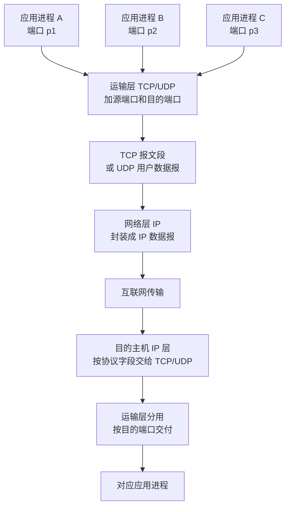

# 计算机网络与通信课后题答案

> 根据《计算机网络与通信_重点笔记.md》整理；原笔记没有展开的地方，已参考相应章节课件并补入原笔记。

## 第 1 章 概述

### 1-02 试简述分组交换的要点。

分组交换的要点如下：

- 把较长的报文划分为较小的数据段，并给每个数据段加上首部，构成分组。
- 分组是网络中的传输单位；首部中含有目的地址、源地址等控制信息。
- 路由器采用存储转发方式：暂存分组，检查首部，查找转发表，再从合适接口转发。
- 每个分组可以独立选择路径，网络链路是逐段占用、动态分配带宽的。
- 优点是高效、灵活、迅速、可靠，适合突发性计算机数据。
- 缺点是分组在路由器中可能排队，产生排队时延；每个分组都要携带首部，增加额外开销。

### 1-03 试从多个方面比较电路交换、报文交换和分组交换的主要优缺点。

| 比较方面 | 电路交换 | 报文交换 | 分组交换 |
| --- | --- | --- | --- |
| 连接建立 | 通信前必须建立专用连接 | 不需要预先建立连接 | 不需要预先建立连接 |
| 传输单位 | 连续比特流 | 整个报文 | 分组 |
| 资源占用 | 端到端通信资源独占 | 逐段存储转发 | 逐段存储转发 |
| 适用场景 | 连续、大量、实时数据 | 早期电报等非实时通信 | 突发性计算机数据 |
| 优点 | 建连后传输速率稳定，连续大量数据传输效率高 | 无需预分配带宽，信道利用率较高 | 高效、灵活，时延通常小于报文交换，适合互联网 |
| 缺点 | 建连需要时间；通信期间即使无数据也占用资源，突发数据利用率低 | 整个报文存储转发，时延大，对节点缓存要求高 | 有排队时延；首部和路由器处理带来额外开销；不保证带宽 |

总结：若连续传送大量数据，且传送时间远大于连接建立时间，电路交换较快；若传送突发数据，报文交换和分组交换不预先分配带宽，能提高信道利用率；分组长度远小于报文长度，因此分组交换通常比报文交换时延更小、灵活性更好。

### 1-07 小写和大写开头的英文名字 internet 和 Internet 在意思上有何重要区别？

- `internet`：小写，泛指“互连网”，即多个网络通过路由器互连起来形成的网络，是一种通用概念。
- `Internet`：大写，专指全球最大的互联网，也就是采用 TCP/IP 协议族、覆盖全球的那个互联网。

简记：`internet` 是一类网络，`Internet` 是全球互联网这个专有名词。

### 1-08 计算机网络都有哪些类别？各种类别的网络都有哪些特点？

可以按不同角度分类。

按作用范围：

| 类别 | 英文缩写 | 特点 |
| --- | --- | --- |
| 广域网 | WAN | 覆盖范围通常几十到几千公里，是互联网核心部分的重要组成，也称远程网 |
| 城域网 | MAN | 覆盖一个城市，作用距离约 5-50 km |
| 局域网 | LAN | 范围较小，通常约 1 km，常采用高速通信线路 |
| 个人区域网 | PAN | 范围很小，约 10 m；无线个人区域网可称 WPAN |

按使用者：

| 类别 | 特点 |
| --- | --- |
| 公用网 | 按规定交费的人都可以使用，也称公众网 |
| 专用网 | 为特殊业务或单位需要建设，供特定用户使用 |

按接入互联网的功能：

- 接入网 AN：用于把用户接入互联网，也称本地接入网或居民接入网。它通常位于用户端系统和本地 ISP 第一个路由器之间。

### 1-17 收发两端距离为 1000 km，传播速率为 2 x 10^8 m/s，计算发送时延和传播时延。

已知：

```text
距离 d = 1000 km = 1 x 10^6 m
传播速率 v = 2 x 10^8 m/s
传播时延 t_prop = d / v = (1 x 10^6) / (2 x 10^8) = 5 x 10^-3 s = 5 ms
```

### (1) 数据长度为 10^7 bit，发送速率为 100 kbit/s

```text
R = 100 kbit/s = 100 x 10^3 bit/s = 1 x 10^5 bit/s
t_send = L / R = 10^7 / 10^5 = 100 s
t_prop = 5 ms = 0.005 s
```

答案：发送时延为 `100 s`，传播时延为 `5 ms`。

### (2) 数据长度为 10^3 bit，发送速率为 1 Gbit/s

```text
R = 1 Gbit/s = 1 x 10^9 bit/s
t_send = L / R = 10^3 / 10^9 = 10^-6 s = 1 us
t_prop = 5 ms = 0.005 s
```

答案：发送时延为 `1 us`，传播时延为 `5 ms`。

结论：

- 发送时延取决于数据长度和发送速率。
- 传播时延取决于传输距离和信号在媒体上的传播速率。
- 大数据、低速率时，发送时延可能占主导；小数据、高速率、远距离时，传播时延可能占主导。
- 提高链路速率只能减小发送时延，不能减小信号在媒体上的传播时延。

### 1-22 网络协议的三个要素是什么？各有什么含义？

网络协议的三个要素是语法、语义和同步。

- 语法：规定数据与控制信息的结构或格式。例如字段如何排列、每个字段占多少位。
- 语义：规定需要发出何种控制信息、完成何种动作以及做出何种响应。例如收到某报文后应确认、转发还是丢弃。
- 同步：规定事件实现顺序的详细说明。例如通信双方何时发送请求、何时应答、何时释放连接。

### 1-24 试述具有五层协议的网络体系结构的要点，包括各层的主要功能。

五层协议体系结构自上而下为：应用层、运输层、网络层、数据链路层、物理层。每一层利用下一层提供的服务，并向上一层提供服务；对等层之间按照本层协议进行逻辑通信。

| 层次 | 主要功能 | 典型数据单位或协议 |
| --- | --- | --- |
| 应用层 | 通过应用进程间的交互完成特定网络应用 | 报文；DNS、HTTP、SMTP |
| 运输层 | 为两台主机中的进程通信提供通用数据传输服务，具有复用和分用功能 | TCP 报文段、UDP 用户数据报 |
| 网络层 | 为分组交换网上的不同主机提供通信服务，负责路由选择和分组转发 | IP 数据报 |
| 数据链路层 | 在相邻节点之间传送帧，进行封装成帧、差错检测等 | 帧 |
| 物理层 | 在传输媒体上传送比特流，规定接口的机械、电气、功能和过程特性 | 比特流 |

补充要点：

- TCP/IP 四层体系结构为：应用层、运输层、网际层、网络接口层。
- 五层结构常用于教学，它把 TCP/IP 的网络接口层进一步拆成数据链路层和物理层。
- 路由器转发分组时通常最高只使用网络层，不处理运输层和应用层内容。

## 第 2 章 物理层

### 2-04 试解释以下名词。

| 名词 | 解释 |
| --- | --- |
| 数据 | 运送消息的实体，是有意义的符号序列 |
| 信号 | 数据的电气或电磁表现 |
| 模拟数据 | 取值连续的数据，如语音、连续变化的图像亮度等 |
| 模拟信号 | 代表消息的参数取值连续的信号 |
| 基带信号 | 来自信源的基本频带信号，常含较多低频成分，甚至含直流成分 |
| 带通信号 | 用载波调制后形成的信号，频率范围搬移到较高频段，只在一段频率范围内通过信道 |
| 数字数据 | 取值离散的数据，如文本、整数、二进制比特序列等 |
| 数字信号 | 代表消息的参数取值离散的信号 |
| 码元 | 用时域波形表示数字信号时，代表不同离散数值的基本波形 |
| 单工通信 | 只能有一个方向的通信，没有反方向交互 |
| 半双工通信 | 双方都可以发送和接收，但不能同时发送 |
| 全双工通信 | 双方可以同时发送和接收信息 |
| 串行传输 | 比特按时间顺序一个接一个发送，线路少，适合远距离传输 |
| 并行传输 | 多个比特在多条线中同时发送，短距离速度快，但线路多、同步要求高 |

### 2-05 物理层的接口有哪几个方面的特性？各包含些什么内容？

物理层主要确定与传输媒体接口有关的 4 个特性：

| 特性 | 内容 |
| --- | --- |
| 机械特性 | 指明接口接线器的形状和尺寸、引线数目和排列、固定和锁定装置等 |
| 电气特性 | 指明接口电缆各条线上出现的电压范围 |
| 功能特性 | 指明某条线上出现的某一电平电压的意义 |
| 过程特性 | 指明不同功能的各种可能事件出现的顺序 |

### 2-09 用香农公式计算信噪比变化。

香农公式：

```text
C = W log2(1 + S/N)
S/N = 2^(C/W) - 1
```

已知信道带宽 `W = 3100 Hz`，原最大信息传输速率 `C1 = 35 kbit/s = 35000 bit/s`。

先求原来的信噪比：

```text
S/N_1 = 2^(35000/3100) - 1
      ≈ 2.50 x 10^3
```

最大信息传输速率增加 60% 后：

```text
C2 = 35000 x 1.6 = 56000 bit/s
S/N_2 = 2^(56000/3100) - 1
      ≈ 2.74 x 10^5
```

因此，新的 `S/N` 应约为 `2.74 x 10^5`，约为原来的：

```text
(2.74 x 10^5) / (2.50 x 10^3) ≈ 109.5 倍
```

若在这个基础上再把 `S/N` 增大到 10 倍：

```text
S/N_3 = 10 x S/N_2
C3 = 3100 log2(1 + S/N_3)
   ≈ 66298 bit/s
   ≈ 66.3 kbit/s
```

若要在 `56 kbit/s` 基础上再增加 20%，需要：

```text
56 x 1.2 = 67.2 kbit/s
```

而 `66.3 kbit/s < 67.2 kbit/s`，所以不能再增加 20%，只能增加约 `18.4%`。

### 2-14 试写出下列英文缩写的全称，并进行简单解释。

| 缩写 | 英文全称 | 简单解释 |
| --- | --- | --- |
| FDM | Frequency Division Multiplexing | 频分复用，把信道总带宽分成多个频带，所有用户同一时间占用不同频带 |
| FDMA | Frequency Division Multiple Access | 频分多址，让多个用户通过不同频带接入共享信道 |
| TDM | Time Division Multiplexing | 时分复用，把时间划分为周期性 TDM 帧，每个用户占用固定时隙 |
| TDMA | Time Division Multiple Access | 时分多址，让多个用户通过不同时隙接入共享信道 |
| STDM | Statistical Time Division Multiplexing | 统计时分复用，按需动态分配时隙，提高线路利用率 |
| WDM | Wavelength Division Multiplexing | 波分复用，在光纤中用不同波长的光载波同时传输多路信号，本质上是光纤中的频分复用 |
| DWDM | Dense Wavelength Division Multiplexing | 密集波分复用，用更密集的波长间隔在一根光纤中复用更多光载波 |
| CDMA | Code Division Multiple Access | 码分多址，各用户在同一时间、同一频带通信，用相互正交的码片序列区分 |
| SONET | Synchronous Optical Network | 同步光纤网，为光纤传输系统定义同步传输的线路速率等级结构 |
| SDH | Synchronous Digital Hierarchy | 同步数字系列，ITU-T 以 SONET 为基础制定的国际标准 |
| STM-1 | Synchronous Transfer Module level 1 | SDH 第 1 级同步传递模块，速率为 `155.52 Mbit/s`，相当于 SONET 的 OC-3 |
| OC-48 | Optical Carrier level 48 | SONET 第 48 级光载波，速率为 `48 x 51.84 = 2488.32 Mbit/s`，约 `2.5 Gbit/s`，对应 SDH 的 STM-16 |

## 第 3 章 数据链路层

### 3-03 网络适配器的作用是什么？网络适配器工作在哪一层？

网络适配器也叫网卡，计算机通过适配器和局域网通信。它的主要作用包括：

- 在计算机内部的并行数据和局域网上的串行数据之间进行串行/并行转换。
- 对发送和接收的数据进行缓存。
- 配合操作系统中的设备驱动程序工作。
- 实现以太网协议，发送和接收以太网帧。
- 检查收到帧的 MAC 地址，只接收发往本站的单播帧、广播帧或相关多播帧。

网络适配器既涉及物理层，也涉及数据链路层；从以太网帧处理和 MAC 地址角度看，主要工作在数据链路层，同时也实现物理层的接口和信号收发功能。

### 3-04 数据链路层的三个基本问题为什么都必须加以解决？

数据链路层的三个基本问题是封装成帧、透明传输和差错检测，它们分别解决“边界、内容、错误”三个问题。

- 封装成帧必须解决：接收方需要知道一帧从哪里开始、到哪里结束，才能从连续比特流中取出完整的帧。
- 透明传输必须解决：数据字段中可能恰好出现与帧定界符相同的比特组合，如果不处理，接收方会误以为帧提前结束或开始，导致数据被错误解释。
- 差错检测必须解决：实际链路传输中可能发生比特差错，如 `1` 变 `0` 或 `0` 变 `1`。接收方需要检测出有差错的帧并丢弃，否则错误数据会继续向上层传递。

### 3-08 要发送的数据为 101110。采用 CRC 的生成多项式 P(X)=X^3+1。试求应添加在数据后面的余数。

生成多项式：

```text
P(X) = X^3 + 1
```

对应的二进制除数为：

```text
P = 1001
```

除数长度为 4 位，所以余数长度 `n = 3` 位。先在原数据后补 3 个 0：

```text
M = 101110
2^3 M = 101110000
```

用模 2 除法计算：

```text
101110000 / 1001
余数 R = 011
```

所以应添加在数据后面的 CRC 余数为：

```text
011
```

最终发送的数据为：

```text
101110011
```

### 3-18 试说明 10BASE-T 中的“10”“BASE”和“T”所代表的意思。

`10BASE-T` 是双绞线星形以太网的命名：

- `10`：数据率为 `10 Mbit/s`。
- `BASE`：基带传输，即链路上传送的是基带信号。
- `T`：Twisted Pair，表示传输媒体为双绞线。

### 3-27 有 10 个站连接到以太网上，计算每站所能得到的带宽。

#### (1) 10 个站都连接到一个 10 Mbit/s 以太网集线器

集线器工作在物理层，逻辑上仍是共享总线，所有站共享总带宽。

```text
每站平均带宽 = 10 Mbit/s / 10 = 1 Mbit/s
```

答案：每个站约 `1 Mbit/s`。

#### (2) 10 个站都连接到一个 100 Mbit/s 以太网集线器

同样是共享总线，只是总带宽变为 `100 Mbit/s`。

```text
每站平均带宽 = 100 Mbit/s / 10 = 10 Mbit/s
```

答案：每个站约 `10 Mbit/s`。

#### (3) 10 个站都连接到一个 10 Mbit/s 以太网交换机

交换机每个端口提供独立带宽，每个站独占一个 `10 Mbit/s` 端口，且交换机可同时连通多对接口。

答案：每个站可得到 `10 Mbit/s`。交换机总容量可看作：

```text
10 Mbit/s x 10 = 100 Mbit/s
```

### 3-33 以太网交换机自学习和转发表填写。

假定端口按题目叙述顺序编号：

```text
1-A，2-B，3-C，4-D，5-E，6-路由器
```

交换机开始时交换表为空。交换机处理帧的规则是：先根据源地址学习“源主机-进入端口”，再查目的地址；若目的地址未知，就向除进入端口外的所有端口泛洪；若目的地址已知，就只向对应端口转发。

| 动作 | 交换表的状态 | 向哪些端口转发帧 | 说明 |
| --- | --- | --- | --- |
| A 发送帧给 D | A -> 1 | 2、3、4、5、6 | 收到帧后学习到 A 在端口 1；目的 D 未知，因此向除端口 1 外的所有端口泛洪 |
| D 发送帧给 A | A -> 1；D -> 4 | 1 | 学习到 D 在端口 4；目的 A 已知在端口 1，因此只转发给 A |
| E 发送帧给 A | A -> 1；D -> 4；E -> 5 | 1 | 学习到 E 在端口 5；目的 A 已知在端口 1，因此只转发给 A |
| A 发送帧给 E | A -> 1；D -> 4；E -> 5 | 5 | A 的表项已存在，可刷新有效时间；目的 E 已知在端口 5，因此只转发给 E |

补充：B 和路由器没有发送过帧，所以交换机还没有学习到它们对应的表项。

## 第 4 章 网络层

### 4-03 作为中间设备，转发器、网桥、路由器和网关有何区别？

| 中间设备 | 工作层次 | 主要作用 |
| --- | --- | --- |
| 转发器/中继器 | 物理层 | 转发比特、再生信号，扩大物理传输距离；不识别帧、MAC 地址或 IP 地址 |
| 网桥/桥接器 | 数据链路层 | 按 MAC 地址转发帧，连接局域网网段，过滤不需要转发的帧 |
| 路由器 | 网络层 | 按 IP 地址和路由表转发 IP 数据报，连接不同网络，是互联网网络互连的主要设备 |
| 网关 | 网络层以上 | 用于不同协议体系或高层协议之间的转换；历史上有些 TCP/IP 文献也把路由器称为网关 |

补充：用转发器或网桥连接起来的若干局域网通常仍看作一个网络；用路由器连接的网络才通常称为网络互连。

### 4-07 试说明 IP 地址与 MAC 地址的区别。为什么要使用这两种不同的地址？

| 比较项 | IP 地址 | MAC 地址 |
| --- | --- | --- |
| 所属层次 | 网络层 | 数据链路层 |
| 地址性质 | 逻辑地址，和网络前缀、主机/接口所在网络有关 | 硬件地址，通常固化在网络适配器中 |
| 作用范围 | 用于跨网络、端到端寻找目的网络和目的主机接口 | 用于同一链路或局域网内直接交付帧 |
| 转发过程中是否变化 | 一个 IP 数据报的源 IP 和目的 IP 通常不变 | 每经过一跳链路，帧首部中的源 MAC 和目的 MAC 都会改变 |
| 典型长度 | IPv4 为 32 位 | 以太网 MAC 地址为 48 位 |

为什么要两种地址：

- IP 地址解决“目的主机在哪个网络、如何跨网络路由”的问题。
- MAC 地址解决“在当前这条链路上，下一跳设备是哪一个网卡”的问题。
- 互联网由许多异构网络组成，网络层用统一的 IP 地址进行路由，链路层则用各自网络的硬件地址完成本链路交付。
- ARP 的作用就是在同一链路内根据下一跳 IP 地址找出对应的 MAC 地址。

### 4-18 根据转发表计算下一跳。

路由表：

| 前缀匹配 | 下一跳 |
| --- | --- |
| `192.4.153.0/26` | `R_3` |
| `128.96.39.0/25` | 接口 `m0` |
| `128.96.39.128/25` | 接口 `m1` |
| `128.96.40.0/25` | `R_2` |
| `*` 默认 | `R_4` |

采用最长前缀匹配：

| 目的地址 | 匹配情况 | 下一跳 |
| --- | --- | --- |
| `128.96.39.10` | 属于 `128.96.39.0/25`，范围 `128.96.39.0-128.96.39.127` | 接口 `m0` |
| `128.96.40.12` | 属于 `128.96.40.0/25`，范围 `128.96.40.0-128.96.40.127` | `R_2` |
| `128.96.40.151` | 不属于 `128.96.40.0/25`，只能匹配默认项 | `R_4` |
| `192.4.153.17` | 属于 `192.4.153.0/26`，范围 `192.4.153.0-192.4.153.63` | `R_3` |
| `192.4.153.90` | 不属于 `192.4.153.0/26`，只能匹配默认项 | `R_4` |

### 4-19 某单位分配到地址块 129.250/16，有 4000 台计算机，平均分布在 16 个地点。给每个地点分配地址块。

每个地点平均有：

```text
4000 / 16 = 250 台计算机
```

每个地点至少需要 250 个主机地址。`/24` 地址块共有 `256` 个地址，通常可用主机地址为 `254` 个，能够满足每个地点的需求。因此可为 16 个地点各分配一个 `/24` 地址块。下面是一种紧凑分配方案：

| 地点 | 地址块 | 最小地址 | 最大地址 | 通常可用主机地址范围 |
| --- | --- | --- | --- | --- |
| 1 | `129.250.0.0/24` | `129.250.0.0` | `129.250.0.255` | `129.250.0.1-129.250.0.254` |
| 2 | `129.250.1.0/24` | `129.250.1.0` | `129.250.1.255` | `129.250.1.1-129.250.1.254` |
| 3 | `129.250.2.0/24` | `129.250.2.0` | `129.250.2.255` | `129.250.2.1-129.250.2.254` |
| 4 | `129.250.3.0/24` | `129.250.3.0` | `129.250.3.255` | `129.250.3.1-129.250.3.254` |
| 5 | `129.250.4.0/24` | `129.250.4.0` | `129.250.4.255` | `129.250.4.1-129.250.4.254` |
| 6 | `129.250.5.0/24` | `129.250.5.0` | `129.250.5.255` | `129.250.5.1-129.250.5.254` |
| 7 | `129.250.6.0/24` | `129.250.6.0` | `129.250.6.255` | `129.250.6.1-129.250.6.254` |
| 8 | `129.250.7.0/24` | `129.250.7.0` | `129.250.7.255` | `129.250.7.1-129.250.7.254` |
| 9 | `129.250.8.0/24` | `129.250.8.0` | `129.250.8.255` | `129.250.8.1-129.250.8.254` |
| 10 | `129.250.9.0/24` | `129.250.9.0` | `129.250.9.255` | `129.250.9.1-129.250.9.254` |
| 11 | `129.250.10.0/24` | `129.250.10.0` | `129.250.10.255` | `129.250.10.1-129.250.10.254` |
| 12 | `129.250.11.0/24` | `129.250.11.0` | `129.250.11.255` | `129.250.11.1-129.250.11.254` |
| 13 | `129.250.12.0/24` | `129.250.12.0` | `129.250.12.255` | `129.250.12.1-129.250.12.254` |
| 14 | `129.250.13.0/24` | `129.250.13.0` | `129.250.13.255` | `129.250.13.1-129.250.13.254` |
| 15 | `129.250.14.0/24` | `129.250.14.0` | `129.250.14.255` | `129.250.14.1-129.250.14.254` |
| 16 | `129.250.15.0/24` | `129.250.15.0` | `129.250.15.255` | `129.250.15.1-129.250.15.254` |

说明：这只是可行方案之一，并没有要求必须用完整个 `129.250.0.0/16` 地址块。

### 4-20 长度为 4000 字节的 IP 数据报经过 MTU 为 1500 字节的网络，如何分片？

固定首部长度为 `20` 字节。

```text
原数据报总长度 = 4000 B
原数据部分长度 = 4000 - 20 = 3980 B
每片最大总长度 = 1500 B
每片最大数据字段长度 = 1500 - 20 = 1480 B
```

除最后一片外，数据字段长度必须是 8 字节的整数倍。`1480` 可以被 8 整除。

```text
3980 = 1480 + 1480 + 1020
```

因此划分为 3 个数据报片：

| 片号 | 数据字段长度 | 总长度 | 片偏移字段 | MF |
| --- | ---: | ---: | ---: | ---: |
| 1 | 1480 B | 1500 B | 0 | 1 |
| 2 | 1480 B | 1500 B | 185 | 1 |
| 3 | 1020 B | 1040 B | 370 | 0 |

片偏移单位是 8 字节，所以：

```text
第 2 片偏移 = 1480 / 8 = 185
第 3 片偏移 = (1480 + 1480) / 8 = 370
```

### 4-27 以下地址中的哪一个和 86.32/12 匹配？

`86.32/12` 可写作 `86.32.0.0/12`，掩码为 `255.240.0.0`。前 12 位固定，即：

- 第 1 字节必须是 `86`。
- 第 2 字节的前 4 位必须和 `32` 相同。

`32` 的二进制是 `0010 0000`，所以第 2 字节范围是：

```text
0010 0000 到 0010 1111
= 32 到 47
```

即地址块范围为：

```text
86.32.0.0 - 86.47.255.255
```

逐个判断：

| 地址 | 是否匹配 | 理由 |
| --- | --- | --- |
| `86.33.224.123` | 匹配 | 第二字节 `33` 在 `32-47` 内 |
| `86.79.65.216` | 不匹配 | 第二字节 `79` 不在 `32-47` 内 |
| `86.58.119.74` | 不匹配 | 第二字节 `58` 不在 `32-47` 内 |
| `86.68.206.154` | 不匹配 | 第二字节 `68` 不在 `32-47` 内 |

答案：只有 `(1) 86.33.224.123` 匹配。

### 4-30 与下列掩码相对应的网络前缀各有多少位？

把掩码写成二进制后，连续 `1` 的个数就是网络前缀长度。

| 掩码 | 二进制开头 | 前缀长度 |
| --- | --- | ---: |
| `192.0.0.0` | `11000000.00000000.00000000.00000000` | `/2` |
| `240.0.0.0` | `11110000.00000000.00000000.00000000` | `/4` |
| `255.224.0.0` | `11111111.11100000.00000000.00000000` | `/11` |
| `255.255.255.252` | `11111111.11111111.11111111.11111100` | `/30` |

### 4-47 地址块 14.24.74.0/24 分配给三个子网。

需求：

```text
N1: 120 个地址 -> 需要 128 地址块 -> /25
N2: 60 个地址  -> 需要 64 地址块  -> /26
N3: 10 个地址  -> 需要 16 地址块  -> /28
```

按从大到小分配，一种方案如下：

| 子网 | 需求 | 分配地址块 | 最小地址 | 最大地址 | 通常可用主机地址范围 |
| --- | ---: | --- | --- | --- | --- |
| N1 | 120 | `14.24.74.0/25` | `14.24.74.0` | `14.24.74.127` | `14.24.74.1-14.24.74.126` |
| N2 | 60 | `14.24.74.128/26` | `14.24.74.128` | `14.24.74.191` | `14.24.74.129-14.24.74.190` |
| N3 | 10 | `14.24.74.192/28` | `14.24.74.192` | `14.24.74.207` | `14.24.74.193-14.24.74.206` |

剩余未分配地址范围：

```text
14.24.74.208 - 14.24.74.255
```

## 第 5 章 运输层

### 5-03 当应用程序使用面向连接的 TCP 和无连接的 IP 时，这种传输是面向连接的还是无连接的？

从应用程序看到的运输层服务来说，这种传输是面向连接的。

原因是：TCP 在无连接、不可靠的 IP 数据报服务之上，向应用层提供了面向连接、可靠、全双工的逻辑通信信道。虽然底层每个 IP 数据报仍然是独立转发、无连接的，但应用程序使用的是 TCP 服务，所以应认为它使用的是面向连接的传输。

### 5-04 试画图解释运输层的复用。

运输层复用是指：发送方多个应用进程的数据，交给 TCP 或 UDP 后，通过端口号区分不同应用，再封装进 IP 数据报发送；接收方再根据协议字段和端口号分用给正确的应用进程。



可以把发送端的封装关系记成：

```text
应用层报文
  -> TCP 报文段 / UDP 用户数据报
  -> IP 数据报
  -> 数据链路层帧
```

### 5-05 试举例说明有些应用程序愿意采用不可靠的 UDP，而不愿意采用可靠的 TCP。

例子：

- 实时语音、IP 电话、视频会议、直播等实时多媒体应用。
- DNS 查询、DHCP、RIP、SNMP、TFTP 等请求/响应或小报文应用。
- 多播或广播应用。

原因：

- UDP 不需要先建立连接，减少了连接建立时延。
- UDP 首部只有 8 字节，开销小。
- UDP 没有拥塞控制，发送速率不会因为网络拥塞机制自动降低，这对某些实时应用很重要。
- 实时音视频通常更怕“迟到”而不是“少量丢失”。丢失一点语音或视频数据可以用应用层办法掩盖，但 TCP 重传可能带来明显延迟。
- 有些应用本身很简单，可以由应用层自己决定是否重传，例如 DNS 查询超时后重新查询。

### 5-09 端口的作用是什么？为什么端口号要划分为三种？

端口的作用：在运输层标识应用层的不同服务或通信终点，使运输层能把收到的数据交给正确的应用进程。网络层 IP 地址只能把分组送到某台主机，端口号进一步指出应交给主机中的哪个应用服务。

不直接用操作系统中的进程号，是因为不同主机、不同操作系统使用的进程标识方式不同，而且进程会动态创建和撤销。端口号提供了统一的、与具体操作系统无关的标识方法。

端口号分为三类：

| 类型 | 范围 | 作用 |
| --- | --- | --- |
| 熟知端口 | `0-1023` | 分配给常用标准服务，客户端可以固定找到这些服务，如 HTTP 80、DNS 53 |
| 登记端口 | `1024-49151` | 给没有熟知端口的应用使用，需要登记，避免端口冲突 |
| 短暂端口/临时端口 | `49152-65535` | 客户进程临时使用，通信结束后可释放给其他客户进程使用 |

### 5-23 TCP 序号和确认号计算。

已知主机 A 向主机 B 连续发送两个 TCP 报文段：

```text
第一个报文段序号 seq = 70
第二个报文段序号 seq = 100
```

TCP 的序号是本报文段数据第一个字节的序号；确认号表示接收方期望收到的下一个字节序号。

#### (1) 第一个报文段携带了多少字节的数据？

第二个报文段从序号 `100` 开始，因此第一个报文段的数据范围是：

```text
70 - 99
```

所以第一个报文段携带：

```text
100 - 70 = 30 字节
```

答案：`30` 字节。

#### (2) 主机 B 收到第一个报文段后发回确认，确认号应是多少？

B 收到第一个报文段后，已经收到字节 `70-99`，下一个期望收到的字节序号是 `100`。

答案：确认号为 `100`。

#### (3) 如果 B 收到第二个报文段后发回的确认号是 180，第二个报文段的数据有多少字节？

第二个报文段从序号 `100` 开始。确认号 `180` 表示 B 已经收到到 `179` 为止的所有字节，下一字节期待 `180`。

```text
第二个报文段数据长度 = 180 - 100 = 80 字节
```

答案：`80` 字节。

#### (4) 如果第一个报文段丢失，但第二个报文段到达 B，B 发送的确认号应为多少？

TCP 使用累积确认。虽然第二个报文段到达了，但 B 还缺少从 `70` 开始的数据，因此仍然期待收到字节 `70`。

答案：确认号应为 `70`。
