> 这是我让codex根据所有学习通上的ppt课件整理出来的关键知识点。
> ~~烧了我好多钱呐~~

## 0. 先建立一张脑图

这门课其实只围绕一个目标：**让车站内的列车和调车作业在任何时候都不会走错路、撞车、挤岔或冒进信号**。

考试复习可以按 5 层理解：

1. **站场基础**：车站、股道、咽喉、道岔、信号机、轨道电路、进路。
2. **联锁思想**：什么条件允许开放信号？什么进路不能同时存在？道岔和信号如何互相制约？
3. **计算机联锁**：用计算机软件和 I/O 接口实现联锁逻辑。
4. **继电器联锁/6502**：用继电器、组合、网络线实现联锁逻辑。
5. **进路选排与建立**：按钮办理后，系统如何选出进路、锁闭进路、开放信号、列车通过后解锁。

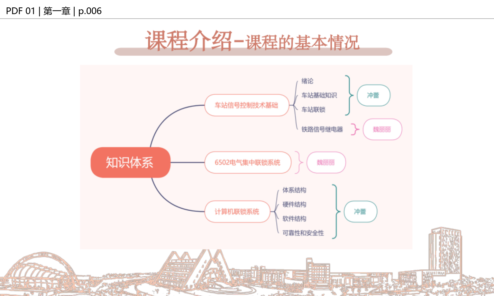

## 1. PDF 顺序与复习权重

| PDF | 课件 | 页数 | 复习定位 |
|---|---|---:|---|
| PDF 01 | 第一章 绪论 | 18 | 了解课程目标和铁路信号系统作用 |
| PDF 02 | 第二章 车站基础知识 | 27 | 必须打牢，后面所有图都靠它 |
| PDF 03 | 第三章 车站联锁 | 20 | 高考点：敌对进路、联锁表、进路控制 |
| PDF 04 | 计算机联锁 | 122 | 高考点：结构、硬件、软件、安全性 |
| PDF 05 | 铁路信号继电器 | 16 | 后面电路图的语言基础 |
| PDF 06 | 电气集中联锁基础 | 38 | 6502、组合、15 条网络线 |
| PDF 07 | 进路选排过程继电器电路 | 52 | 选排阶段：AJ、方向、JXJ、DCJ/FCJ、KJ |
| PDF 08 | 进路建立过程继电器电路 | 69 | 建立、锁闭、开放、解锁，考试最重 |

## 2. 零基础术语表

**车站**：列车办理到发、会让、越行、解编、调车等作业的地点。信号课里更关心它的线路、道岔、信号机和控制设备。

**股道**：车站内供列车停留、通过或作业的一条线路。平面图上通常用 I、II、3、4 等标注。

**咽喉区**：车站两端道岔密集的区域。列车进出站都要经过咽喉，冲突风险集中，所以联锁条件很多。

**道岔**：让车辆从一条线路转到另一条线路的设备。道岔有**定位**和**反位**：可以先粗略理解为“默认方向”和“改变后的方向”。  
道岔是联锁的关键，因为同一组道岔同一时刻只能处在一个位置。

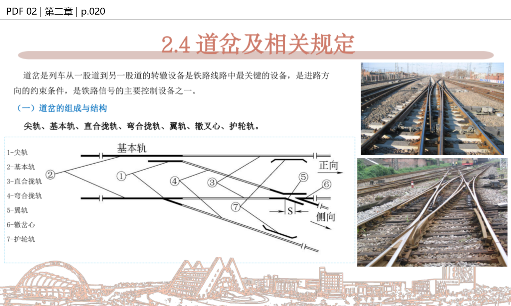

**信号机**：告诉司机能不能走、往哪里走、以什么限制走的设备。常见有进站、出站、预告、复示、调车信号机。

**轨道电路**：把一段钢轨作为电路来判断“这段线路有没有车”。有车占用时，轨道继电器状态会变化，系统据此防止把车开进已占用区段。

**轨道区段**：为了检测和控制，把站内线路划成若干段。每段通常对应一个轨道电路。

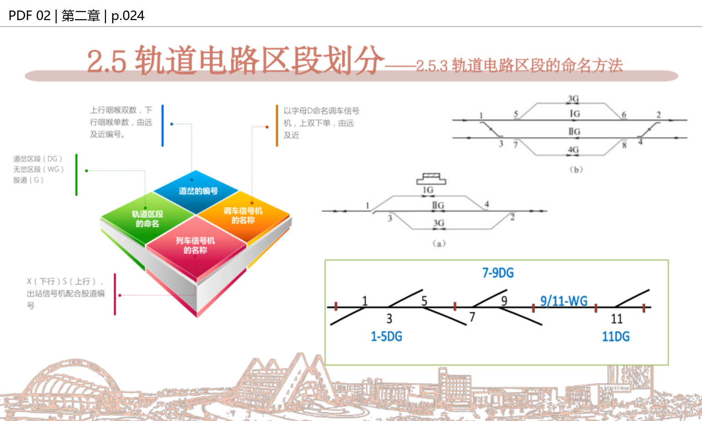

**进路**：列车或调车从一个地点到另一个地点要走的线路范围，包括信号机、道岔位置、轨道区段等。  
一句话：**进路就是“系统给车安排的一条安全路线”。**

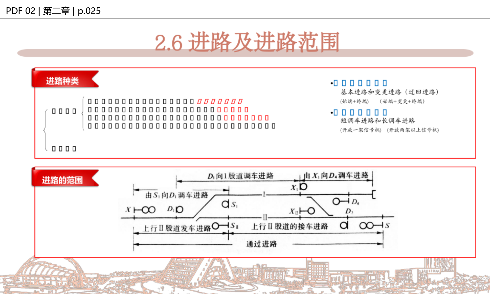

**联锁**：信号机、道岔、进路之间互相制约的安全关系。  
最核心的三句话：

- 道岔位置不正确，信号不能开放。
- 信号开放后，道岔不能转换。
- 敌对进路不能同时建立。

**敌对进路**：不能同时存在的两条进路。原因可能是抢同一股道、抢同一道岔、迎面冲突、侧面冲突或破坏防护关系。

**锁闭**：把进路中的道岔和区段“锁住”，防止列车运行期间被错误改变。

**解锁**：列车安全通过或人工确认安全后，解除锁闭，让道岔和区段恢复可办理状态。

**继电器**：电气控制里的开关。线圈通电叫励磁/吸起，断电叫落下。  
前接点：吸起时闭合。后接点：落下时闭合。

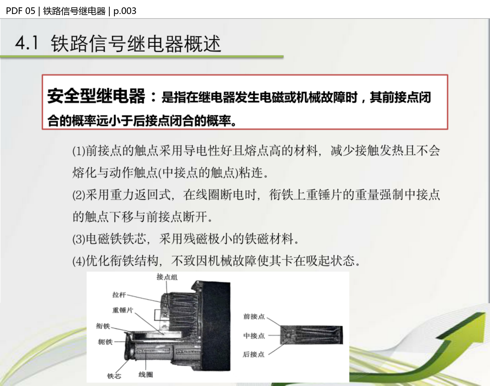

**6502 电气集中**：一种经典继电器联锁系统，用继电器组合和网络线实现车站信号集中控制。

**计算机联锁**：用计算机软件实现联锁逻辑，用 I/O 接口采集轨道、道岔、信号状态并输出控制命令。

## 3. 第二章：车站基础知识

### 3.1 车站与作业

车站按功能可理解为：列车运行中的“交通节点”。它不只是停车，还要完成会让、越行、调车、解编、检修等。

常考分类：

- **会让站**：主要办理列车会让和越行。
- **越行站**：主要办理列车越行。
- **中间站**：办理客货、会让、越行等基本作业。
- **编组站**：以货车解体、编组为主。

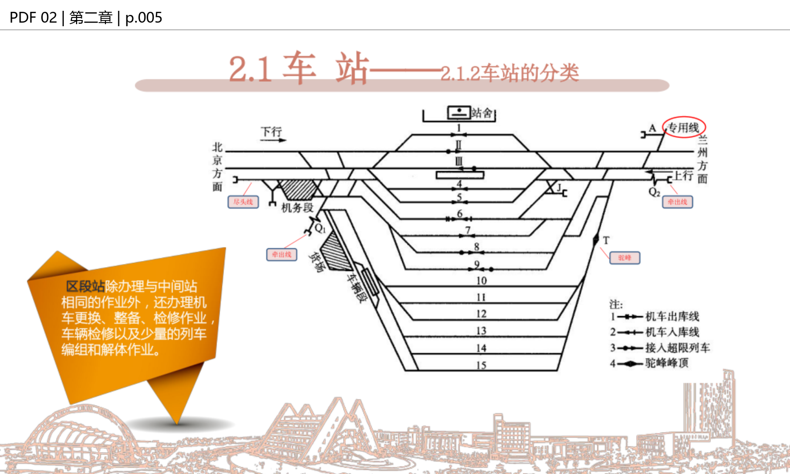

### 3.2 信号机

列车信号机常见类型：

- **进站信号机**：防护车站入口，控制列车能否进站。
- **出站信号机**：控制列车能否由股道出站。
- **预告信号机**：提前预告主体信号机状态。
- **复示信号机**：主体信号机受地形影响看不清时，复示主体信号机。

调车信号机常见类型：

- **调车起始信号机**：调车进路起点。
- **调车阻拦信号机**：防止车辆越过某处。
- **调车折返信号机**：用于折返调车。
- **并置、差置、单置信号机**：按站场布置位置分类。

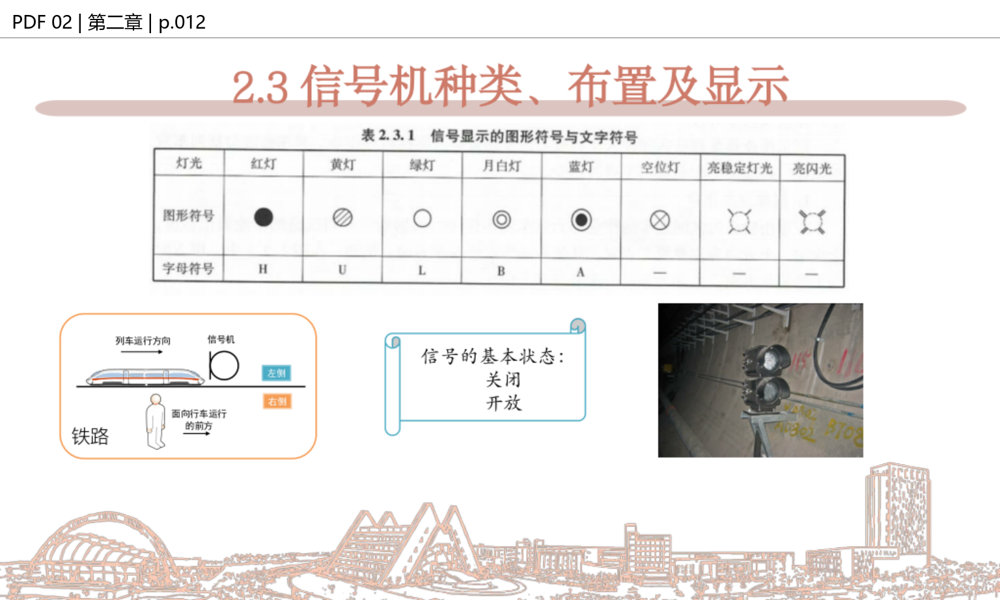

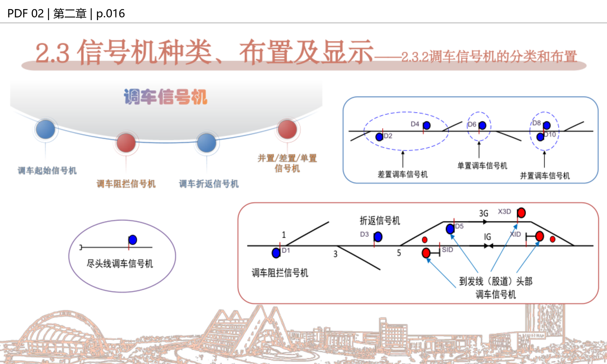

### 3.3 道岔、轨道电路和进路

道岔由尖轨、基本轨、辙叉心、护轮轨等组成。考试一般不要求机械细节，但要会读图上道岔编号和定位/反位。

轨道电路区段划分原则的直觉：

- 不能让一个区段太长，否则占用检测不精细。
- 信号机附近、道岔附近要划分清楚，否则系统不知道车到底压在哪里。
- 进路范围内的区段要能支持锁闭和解锁。

进路分类：

- **列车进路**：接车、发车、通过等。
- **调车进路**：调车作业用，速度低、规则和列车进路不同。
- **基本进路**：通常路径。
- **变通进路**：基本进路不能用时，绕行的替代路径。

背诵句：**进路不是一条线，而是一组“信号机 + 道岔位置 + 轨道区段 + 防护关系”的集合。**

## 4. 第三章：车站联锁

### 4.1 联锁关系

联锁关系分三类：

1. **进路与进路之间**：敌对进路不能同时建立。
2. **进路与道岔之间**：进路中道岔位置必须正确；进路建立后道岔不能变。
3. **进路与信号机之间**：条件满足才能开放信号；条件破坏时信号要关闭。

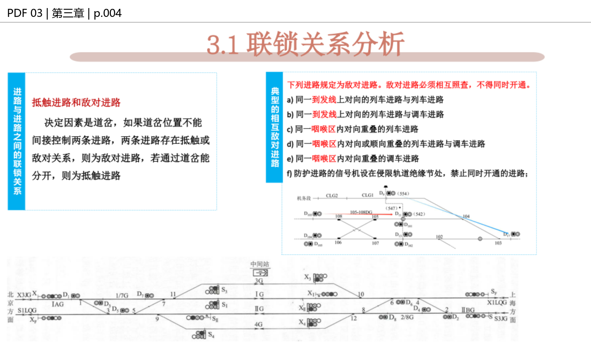

### 4.2 敌对进路怎么判断

典型敌对进路：

- 同一到发线上对向列车进路与列车进路。
- 同一到发线上对向列车进路与调车进路。
- 同一咽喉区内对向重叠的列车进路。
- 同一咽喉区内对向或顺向重叠的列车进路与调车进路。
- 向同一无岔区段的进路。
- 防护进路的信号机设在侵限轨道绝缘节处，禁止同时开通的进路。

零基础判断法：看两条车要不要**抢同一段轨道、抢同一道岔、迎面相撞、侧面冲突**。只要会造成危险，就不能同时开放。

### 4.3 联锁表

联锁表是把“某条进路需要哪些条件”写成表。常见检查项：

- 进路中的道岔位置是否正确。
- 进路中的轨道区段是否空闲。
- 敌对进路是否未建立。
- 信号机开放条件是否满足。
- 防护道岔、带动道岔是否到位。

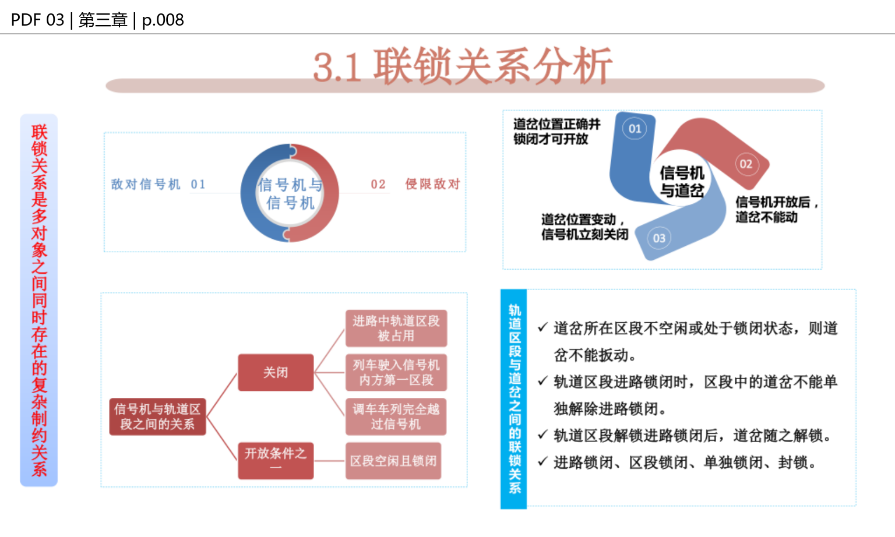

背诵句：**联锁表就是把安全条件表格化，计算机联锁和继电器联锁都要按它执行。**

## 5. PDF 04：计算机联锁

### 5.1 四层结构

计算机联锁通常分 4 层：

1. **人机交互层**：控制台、显示器、操作表示软件。人通过它办理进路，看站场状态。
2. **联锁运算层**：系统核心，执行联锁逻辑，决定能否选路、锁闭、开放信号、解锁。
3. **输入/输出接口层**：采集现场设备状态，输出控制命令。
4. **室外设备层**：信号机、转辙机、轨道电路等。

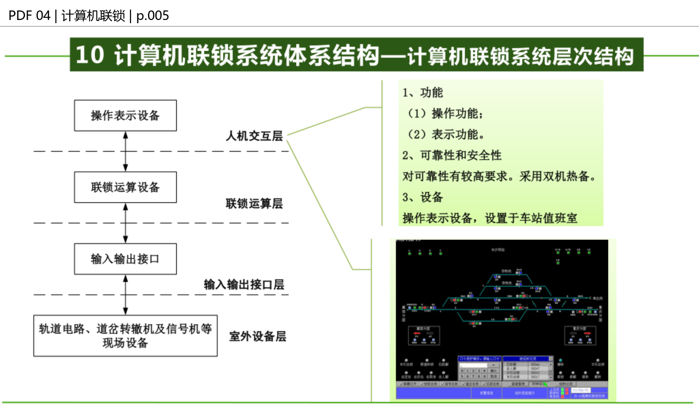

三种典型构建：

- 并行总线扩展 + 继电接口。
- 串行总线扩展 + 继电接口。
- 串行总线扩展 + 全电子接口。

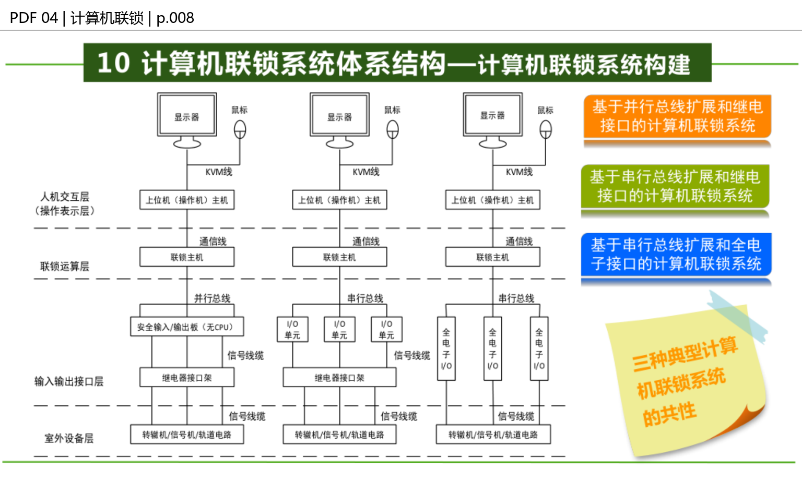

### 5.2 硬件

硬件可按功能记：

- **操作表示设备**：接收操作命令，显示站场、按钮、报警、文字信息。
- **联锁运算设备**：运行联锁逻辑。
- **输入接口**：采集信号机、道岔、轨道电路状态。
- **输出接口**：驱动信号机显示、道岔转换等。
- **外部接口**：与 CTC、TDCS、列控中心、RBC、电务维护机等通信。

### 5.3 软件

软件通常分：

- **操作表示软件**：操作、显示、提示、记录、数据接口。
- **联锁逻辑运算软件**：进路控制、道岔控制、信号控制、解锁控制。
- **输入/输出软件**：采集状态、驱动接口。
- **联锁数据**：站场、信号机、道岔、区段、进路表等基础数据。

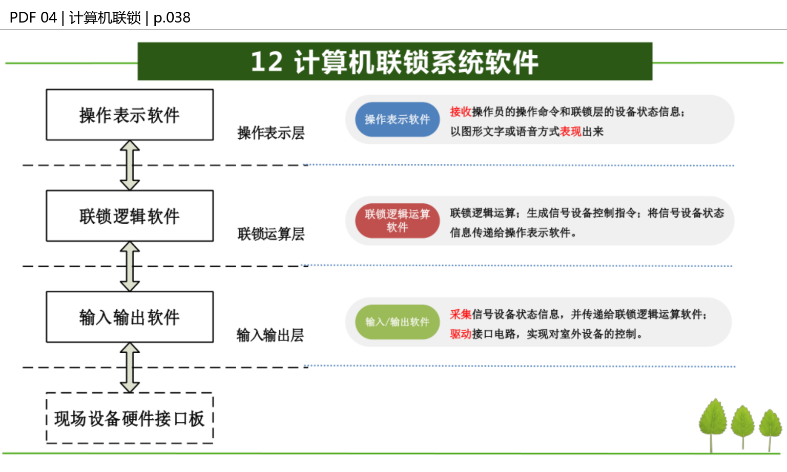

联锁软件处理进路时的核心思路：

1. 接收操作命令。
2. 检查进路条件。
3. 选路并锁闭。
4. 开放信号。
5. 保持信号开放。
6. 列车通过后按条件解锁。

正常解锁条件常见表述：

- 分段解锁：信号已关闭，满足三点检查条件，所在区段解锁。
- 一次解锁：信号已关闭，所有区段按进路方向被顺序占压，所在区段解锁。

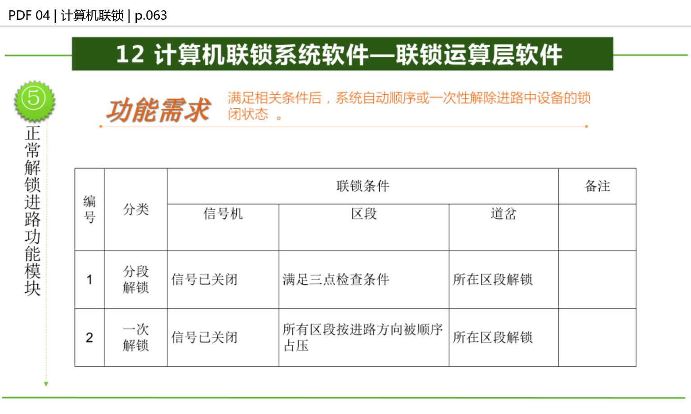

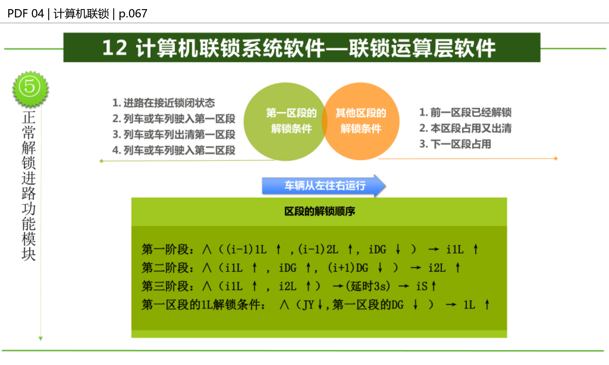

### 5.4 可靠性与安全性

铁路信号中的“安全”不是日常的“不坏”，而是：**即使坏了，也要坏向安全侧**。  
也就是故障时宁可让信号关闭、列车停下，也不能错误开放信号。

RAMS：

- R：Reliability，可靠性。
- A：Availability，可用性。
- M：Maintainability，可维护性。
- S：Safety，安全性。

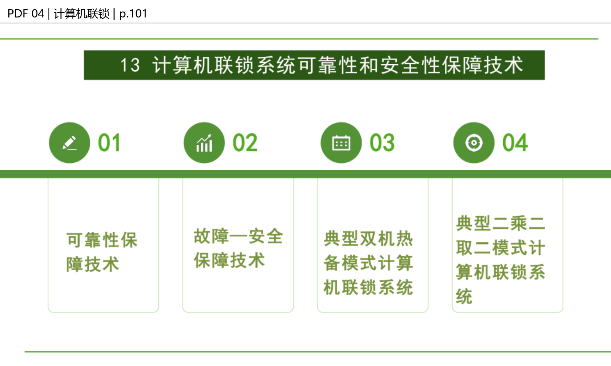

常见安全保障：

- **避错技术**：高可靠元件、环境防护、质量控制，尽量不出故障。
- **容错技术**：故障发生后仍能维持工作或转入安全状态。
- **动态冗余**：故障后切换备用模块。
- **静态冗余**：多个模块同时工作，通过表决决定输出，如三取二。
- **动态故障-安全输出**：只有持续正确的动态信号才能维持输出，故障时输出自然落向安全侧。

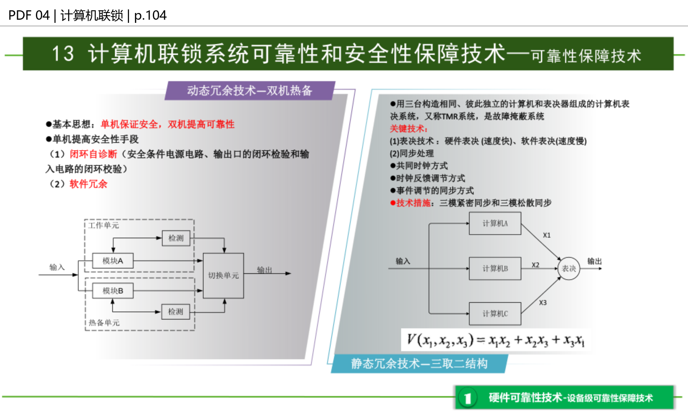

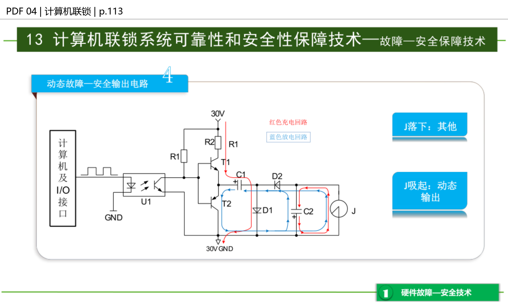

典型模式：

- **双机热备**：单机保证安全，双机提高可靠性。
- **二乘二取二**：两套二取二系统组合，提高安全和可靠性。
- **三取二**：三个通道表决，两个一致才有效。

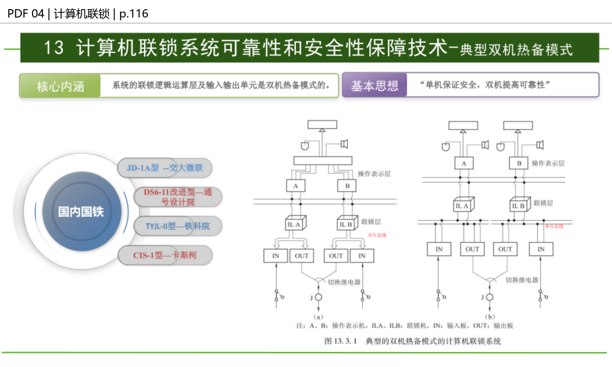

高频背诵句：

- 计算机联锁核心是联锁运算层。
- I/O 层负责采集现场状态和驱动室外设备。
- 安全性核心是故障-安全。
- 双机热备提高可靠性，二乘二取二兼顾可靠性和安全性。

## 6. PDF 05：铁路信号继电器

继电器电路是 6502 的语言。看电路图时先问三个问题：

1. 这个继电器什么时候吸起？
2. 它吸起后通过哪些前接点保持？
3. 它落下后会切断什么或开放什么？

基本逻辑：

- 串联 = 与：所有条件满足才通。
- 并联 = 或：任一条件满足即可通。
- 前接点 = 继电器吸起后闭合。
- 后接点 = 继电器落下后闭合。

自闭电路很重要：继电器吸起后，经自己的前接点继续供电，从而“记住”已经发生的动作。

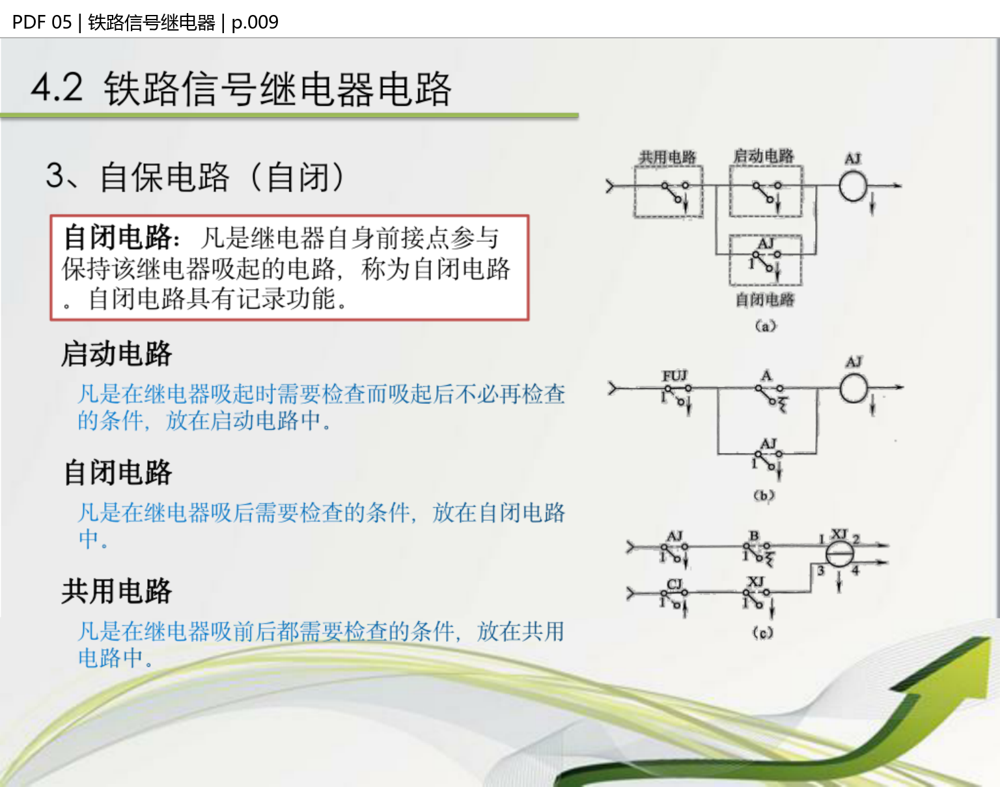

高频背诵句：

- 前接点跟吸起，后接点跟落下。
- 自闭电路负责保持，启动电路负责初次吸起。
- 断线保护要求断线时继电器落下。
- 混线保护防止外来电源使继电器错误吸起。

## 7. PDF 06：6502 电气集中基础

### 7.1 6502 是什么

6502 电气集中用继电器电路集中控制道岔、进路和信号机。  
它的设计思想是：把站场中重复出现的设备做成**定型组合**，再按站场图拼接成完整电路。

### 7.2 15 条网络线

6502 的网络线可分为：

- **1-6 线：选择组**，用于选路、选道岔、选信号点。
- **7-13 线：执行组**，用于检查、锁闭、开放信号、解锁。
- **14/15 线：表示灯**，白光带、红光带显示。

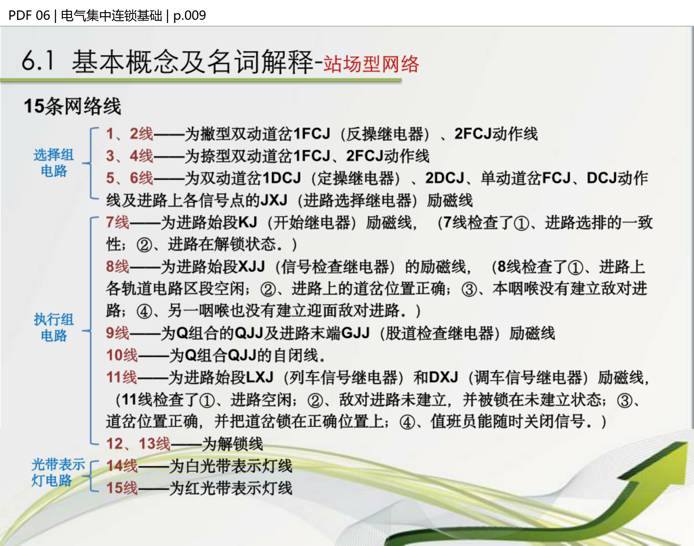

### 7.3 组合与组合架

组合是若干继电器和配线构成的标准模块。  
组合架是安装组合的架子，按排、架、层编号定位。

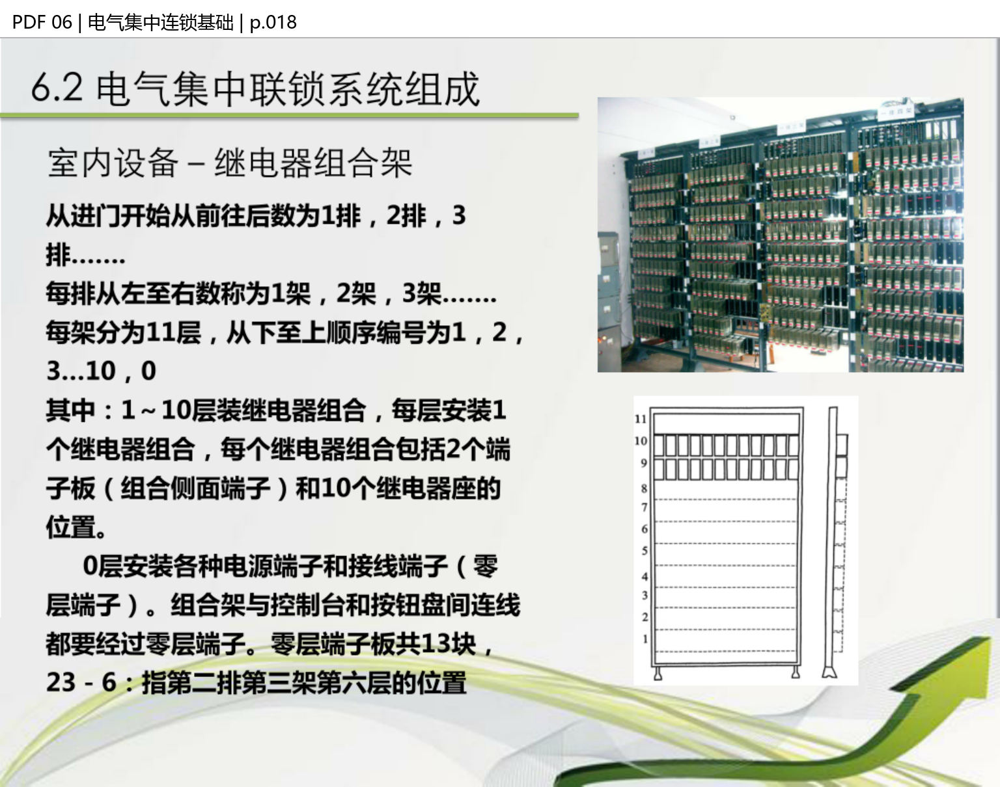

常见组合：

- 道岔组合：DD、SDZ、SDF。
- 信号组合：LXZ、YD、LXF、DX、DXF。
- 区段组合：Q。
- 方向组合：F。
- 电源组合：DY。

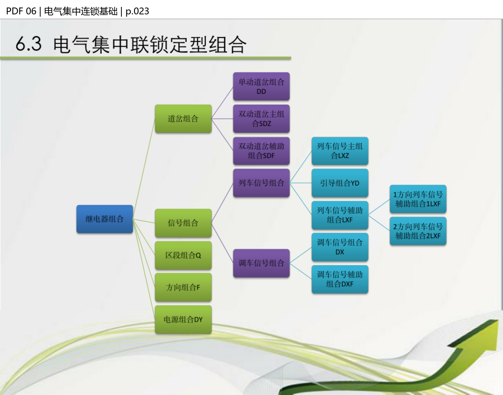

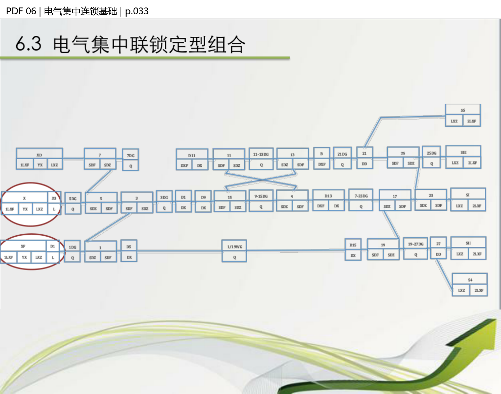

高频背诵句：

- 单动道岔用 DD。
- 双动道岔用 SDZ/SDF。
- 每一道岔区段、列车进路上的无岔区段都要 Q 组合。
- 6502 的本质是按站场图把定型组合拼成联锁电路。

## 8. PDF 07：进路选排过程继电器电路

### 8.1 选排阶段做什么

进路选排 = 按按钮后，系统先把“想办哪条路”选出来。  
要完成三件事：

1. 记录进路范围和性质。
2. 选出道岔及信号点。
3. 检查进路选排一致性。

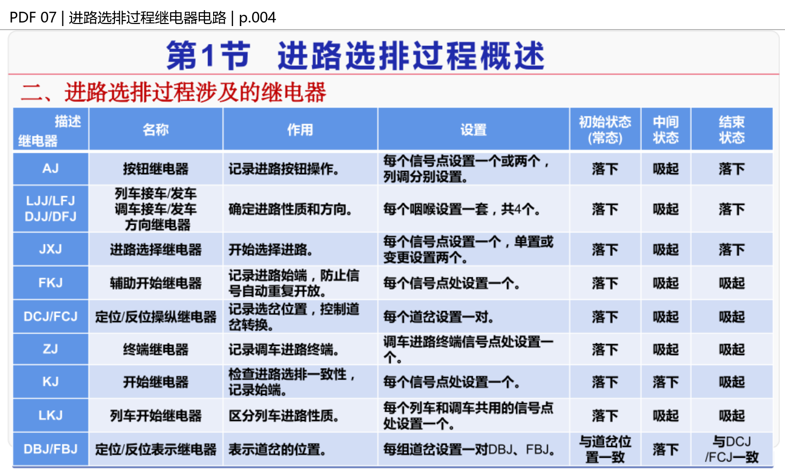

### 8.2 重要继电器

| 继电器 | 零基础解释 | 速记 |
|---|---|---|
| AJ | 按钮继电器，记录按了哪个按钮 | AJ 记按钮 |
| LJJ/LFJ/DJJ/DFJ | 方向继电器，确定列车/调车、接车/发车方向 | 四选一 |
| JXJ | 进路选择继电器，传递选路电源，选信号点 | JXJ 选路 |
| FKJ | 辅助开始继电器，记录始端，防止重复开放 | FKJ 记始端 |
| ZJ | 终端继电器，主要用于调车终端 | ZJ 记终端 |
| DCJ/FCJ | 道岔操纵继电器，定位/反位 | D 定位，F 反位 |
| KJ | 开始继电器，检查选排一致性 | KJ 查一致 |

### 8.3 1-6 线规律

高频规律：

- 1、2 线：选撇型双动道岔反位。
- 3、4 线：选捺型双动道岔反位。
- 5、6 线：选双动定位、单动定位/反位和信号点。
- 顺序：先选双动反位，再选定位和信号点。

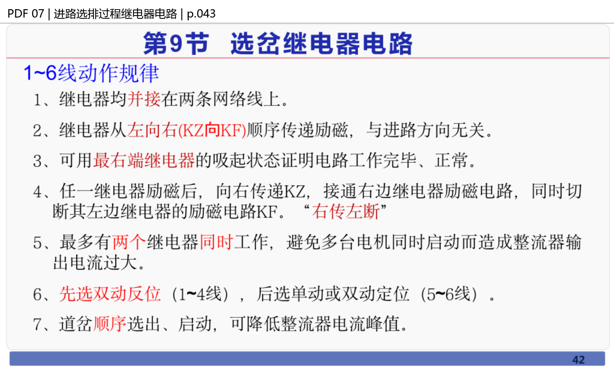

### 8.4 KJ 的作用

KJ 检查：

- DCJ/FCJ 与 DBJ/FBJ 是否一致。
- 进路是否在解锁状态。
- 敌对进路是否未建立。

KJ 不吸起，说明选排不合格，进路不能进入建立阶段。

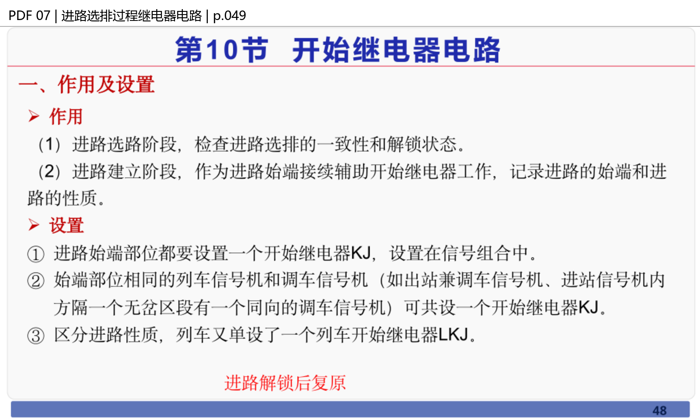

## 9. PDF 08：进路建立过程继电器电路

### 9.1 主线流程

进路建立 = **先检查能不能走，再把路锁住，最后开放信号**。

三步：

1. 检查锁闭条件。
2. 实现进路锁闭。
3. 开放并保持信号。

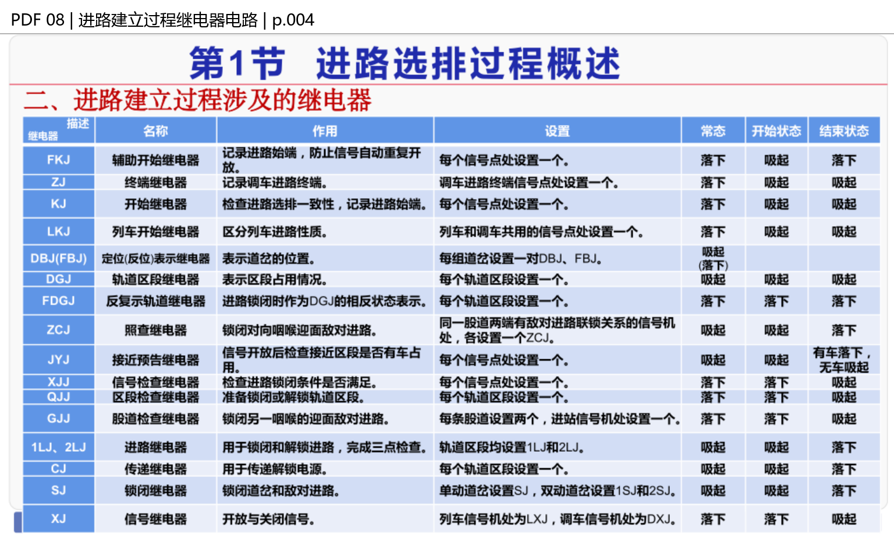

网络线记忆：

- **8 线**：信号检查 XJJ。
- **9、10 线**：区段检查 QJJ、股道检查 GJJ，并实现锁闭。
- **11 线**：开放信号 LXJ/DXJ，引导时涉及 YXJ。

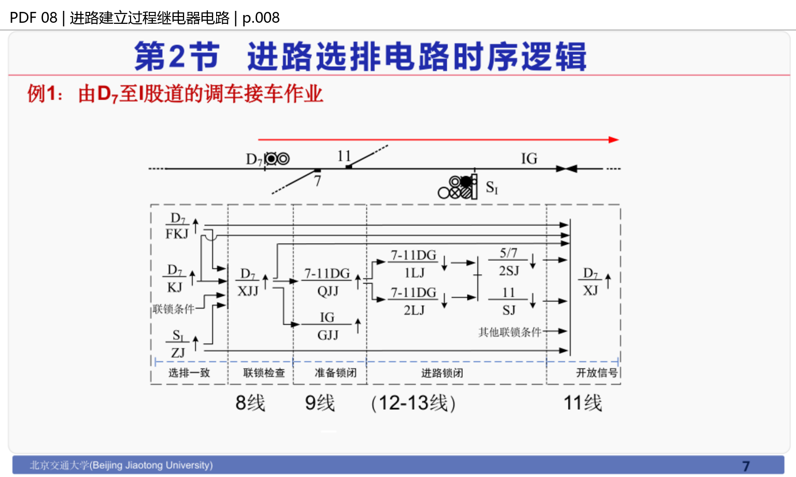

### 9.2 XJJ：信号检查继电器

XJJ 检查“是否可以开放信号”。它不是直接点灯，而是证明开放信号的条件成立。

检查内容通常包括：

- 进路空闲。
- 道岔位置正确。
- 敌对进路未建立。
- 取消/人工解锁状态安全。

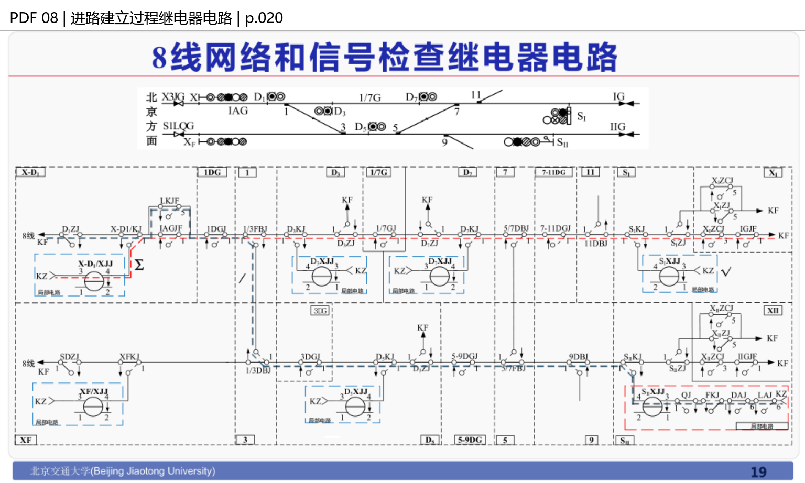

易混点：**XJJ 是检查开放可能性，LXJ/DXJ 才控制信号开放。**

### 9.3 QJJ、GJJ、SJ：锁闭相关

QJJ：区段检查继电器，检查并准备锁闭轨道区段。  
GJJ：股道检查继电器，配合 ZCJ 防止迎面敌对。  
SJ：锁闭继电器，锁闭道岔和敌对进路，常态吸起，锁闭或有车占用时落下。

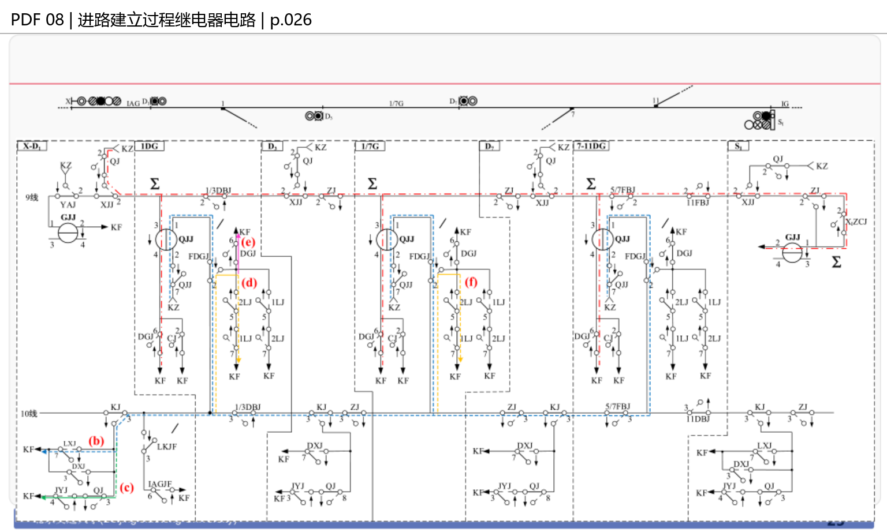

### 9.4 LXJ/DXJ：开放信号

开放信号前要再次检查：

- 进路空闲。
- 道岔位置正确。
- 进路已锁闭。
- 敌对进路未建立。
- 灯丝等设备条件正常。

列车信号用 LXJ，调车信号用 DXJ。

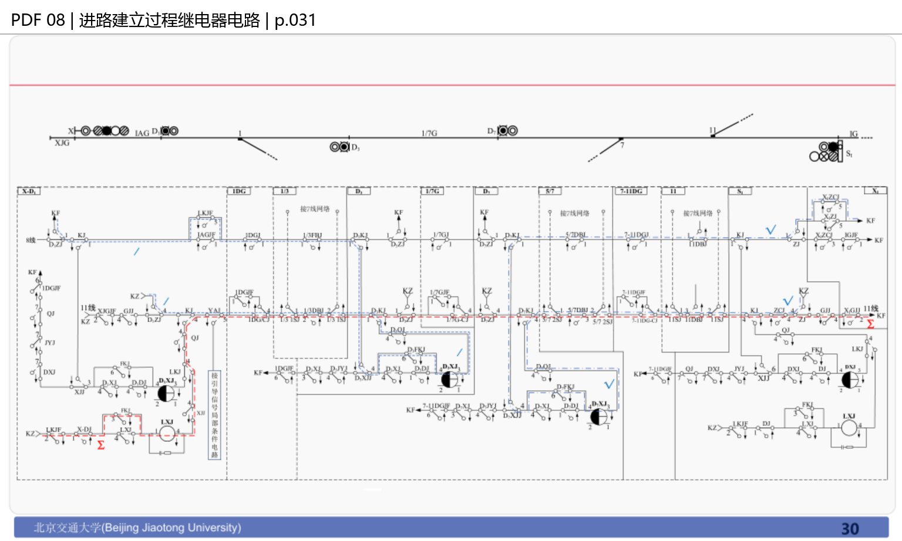

### 9.5 解锁

解锁方式：

- 自动解锁。
- 调车中途返回解锁。
- 取消进路。
- 人工延时解锁。
- 区段故障解锁。

1LJ/2LJ：进路继电器，常态吸起，进路锁闭后落下，解锁时再吸起。  
CJ：传递继电器，正常解锁时缓吸 3-4 秒，取消/人工解锁时快速吸起。

三点检查：

1. 前一区段占用并出清。
2. 本区段占用并出清。
3. 下一区段占用。

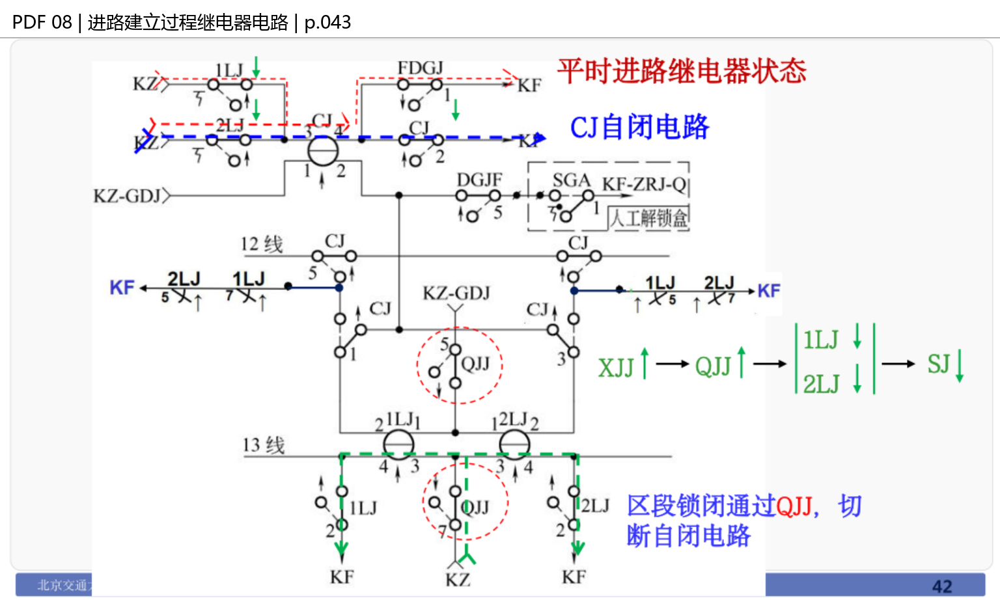

正常通过时，进路从始端向终端逐段解锁：

- 左向右进路：1LJ 先吸起，2LJ 后吸起。
- 右向左进路：2LJ 先吸起，1LJ 后吸起。

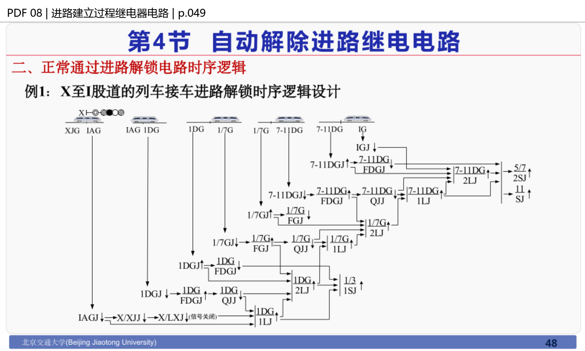

取消进路与人工延时解锁：

- 取消进路：列车尚未接近，属于预先锁闭。
- 人工延时解锁：列车已接近，先关闭信号，再按规定延时后解锁。
- 接车进路和正线发车进路：延时 3 分钟。
- 站线/侧线发车和调车进路：延时 30 秒。

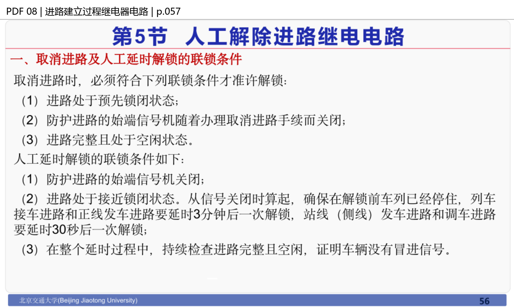

区段故障解锁用于异常情况，必须人工确认安全，两人配合；列车运行前方区段不能解锁。

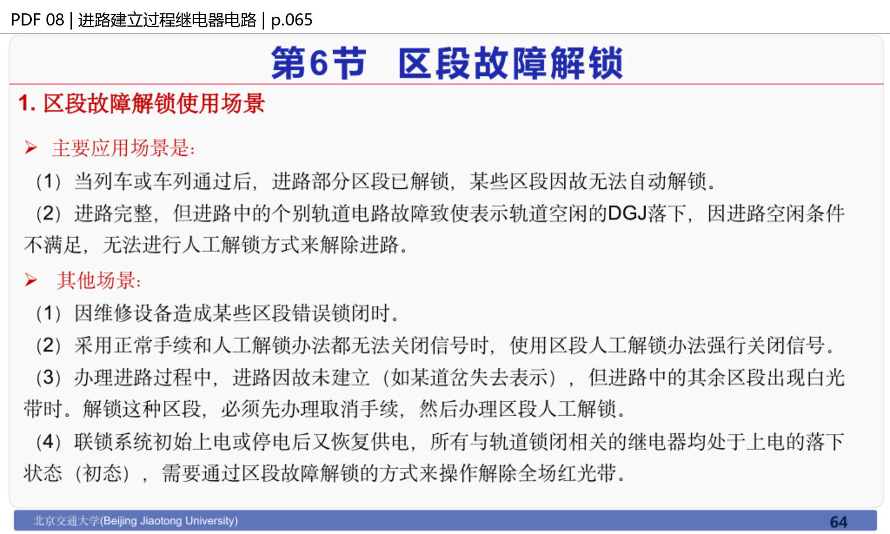

## 10. 最后一小时背诵清单

1. 车站信号系统的任务：保证站内行车安全，防止追尾、迎面相撞、侧面冲突、脱轨。
2. 进路 = 信号机 + 道岔位置 + 轨道区段 + 防护关系。
3. 联锁三句话：道岔不到位不开信号；信号开放后道岔不能动；敌对进路不能同时开。
4. 轨道电路用于检查区段占用/空闲。
5. 进站、出站、预告、复示、调车信号机的作用要会区分。
6. 计算机联锁四层：人机交互、联锁运算、I/O 接口、室外设备。
7. 计算机联锁软件：操作表示、联锁逻辑、输入输出、联锁数据。
8. 故障-安全：故障时导向关闭信号、停止列车的安全状态。
9. RAMS：可靠性、可用性、可维护性、安全性。
10. 前接点吸起闭合，后接点落下闭合。
11. 串联是与，并联是或，自闭电路负责保持。
12. 6502：1-6 线选择组，7-13 线执行组，14/15 线表示灯。
13. AJ 记按钮，方向继电器定方向，JXJ 选路，DCJ/FCJ 选道岔，KJ 查一致。
14. 进路建立三步：检查锁闭条件、实现进路锁闭、开放并保持信号。
15. 8 线 XJJ 查开放可能性，9/10 线 QJJ/GJJ 查区段股道并锁闭，11 线 LXJ/DXJ 开放信号。
16. ZCJ 防迎面敌对，SJ 锁闭道岔和敌对进路。
17. 1LJ/2LJ 常态吸起，锁闭后落下，解锁时吸起。
18. 三点检查：前一区段出清、本区段出清、下一区段占用。
19. CJ 正常解锁缓吸 3-4 秒，取消/人工解锁快速吸起。
20. 取消进路用于预先锁闭；人工延时解锁用于接近锁闭。

## 11. 易混对照

| 易混项 | 区别 |
|---|---|
| XJJ 与 LXJ/DXJ | XJJ 检查能否开放；LXJ/DXJ 控制信号开放 |
| QJJ 与 GJJ | QJJ 查轨道区段；GJJ 查股道和迎面敌对 |
| ZCJ 与 SJ | ZCJ 照查两端咽喉；SJ 锁闭道岔和敌对 |
| 取消进路与人工延时解锁 | 取消用于未接近；人工延时用于已接近 |
| 定位与反位 | 定位通常是常用/规定位置；反位是转换后位置 |
| 列车进路与调车进路 | 列车进路用于列车到发通过；调车进路用于站内调车 |
| 基本进路与变通进路 | 基本是默认路径；变通是替代路径 |
| 继电器联锁与计算机联锁 | 前者用继电器电路实现逻辑；后者用软件和 I/O 实现逻辑 |

## 12. 高清关键页索引

优先看这些图片，能最快建立图感：

- `output/key_pages/pdf02_p005_第二章.png`：站场线路、股道、咽喉区。
- `output/key_pages/pdf02_p012_第二章.png`：信号机显示符号。
- `output/key_pages/pdf02_p016_第二章.png`：调车信号机布置。
- `output/key_pages/pdf02_p020_第二章.png`：道岔结构。
- `output/key_pages/pdf02_p024_第二章.png`：轨道电路区段命名。
- `output/key_pages/pdf02_p025_第二章.png`：进路范围。
- `output/key_pages/pdf03_p004_第三章.png`：敌对进路。
- `output/key_pages/pdf04_p005_计算机联锁.png`：计算机联锁四层结构。
- `output/key_pages/pdf04_p038_计算机联锁.png`：计算机联锁软件层次。
- `output/key_pages/pdf04_p101_计算机联锁.png`：RAMS 与安全性。
- `output/key_pages/pdf05_p003_铁路信号继电器.png`：安全型继电器。
- `output/key_pages/pdf06_p009_电气集中连锁基础.png`：6502 15 条网络线。
- `output/key_pages/pdf07_p004_进路选排过程继电器电路.png`：选排继电器总表。
- `output/key_pages/pdf08_p004_进路建立过程继电器电路.png`：建立过程继电器总表。
- `output/key_pages/pdf08_p008_进路建立过程继电器电路.png`：建立流程。
- `output/key_pages/pdf08_p049_进路建立过程继电器电路.png`：自动解锁。
